<div align="center">


<br/>

# Infrastructure Design Document
## & Operations Guide

### Mathera Tech Production Infrastructure

<br/>

| | |
|---|---|
| **Document Title** | Infrastructure Design Document (IDD) & Operations Guide |
| **Project** | Mathera Tech Production Infrastructure |
| **Company** | Mathera Tech Pvt Ltd |
| **Site** | Mandya, Karnataka, India |
| **Version** | v1.0 |
| **Date** | 11 July 2026 |
| **Classification** | 🔒 **INTERNAL — CONFIDENTIAL** |
| **Status** | Released for Production |

<br/>

> ⚠️ **CONFIDENTIALITY NOTICE**
> This document contains proprietary and confidential information belonging to **Mathera Tech Pvt Ltd**. It is intended solely for internal use by authorized personnel. Unauthorized disclosure, copying, distribution, or use of the contents — in whole or in part — is strictly prohibited. If you have received this document in error, please notify the Document Owner and destroy all copies.

</div>

<div style="page-break-after: always;"></div>

---

## 📄 Document Control

### Document Identification

| Attribute | Detail |
|-----------|--------|
| **Document ID** | MT-IDD-INFRA-001 |
| **Document Title** | Mathera Tech Production Infrastructure — IDD & Operations Guide |
| **Version** | v1.0 |
| **Release Date** | 11 July 2026 |
| **Classification** | Internal — Confidential |
| **Document Type** | Infrastructure Design & Operations |
| **Retention** | Life of infrastructure + 3 years |
| **Review Cycle** | Semi-annual (next review: 11 January 2027) |
| **File Format** | Markdown (source) → DOCX / PDF (distribution) |

### Ownership & Approval

| Role | Name | Title | Signature | Date |
|------|------|-------|-----------|------|
| **Author** | Kishore Mohankumar | Infrastructure Architect | _________________ | 11-Jul-2026 |
| **Document Owner / Custodian** | Kishore Mohankumar | Infrastructure Architect | _________________ | 11-Jul-2026 |
| **Reviewer** | N/A | — | _________________ | ___________ |
| **Approver** | Sumanth G | Chief Executive Officer | _________________ | ___________ |

### Change History / Revision Log

| Version | Date | Author | Description of Change | Status |
|---------|------|--------|-----------------------|--------|
| **1.0** | 11-Jul-2026 | Kishore Mohankumar | Initial release — complete production infrastructure baseline design & operations guide. | Released |

### Distribution List

| Recipient | Role | Copy Type |
|-----------|------|-----------|
| Sumanth G | CEO / Approver | Master (Read/Approve) |
| Kishore Mohankumar | Infrastructure Architect | Master (Read/Write) |
| IT Operations Team | Operations | Controlled Copy |

> 📌 **Distribution Control:** This is a controlled document. Printed copies are considered **uncontrolled** unless stamped and dated. Always refer to the latest master version held by the Document Owner.

### Legend — Assumption Flags

Throughout this document, values that were **not explicitly confirmed** and have been designed to **enterprise best-practice defaults** are marked as follows:

> 🟡 **`[ASSUMPTION — VALIDATE]`** — A professionally recommended default value. Confirm against live environment and update before final sign-off.

Confirmed, customer-supplied values carry no flag.

<div style="page-break-after: always;"></div>

---

## 📑 Table of Contents

1. [Executive Summary](#1-executive-summary)
2. [Infrastructure Overview](#2-infrastructure-overview)
3. [Business Requirements](#3-business-requirements)
4. [Scope](#4-scope)
5. [Hardware Inventory](#5-hardware-inventory)
6. [Software Inventory](#6-software-inventory)
7. [Virtualization Architecture](#7-virtualization-architecture)
8. [Active Directory Architecture](#8-active-directory-architecture)
9. [DNS Architecture](#9-dns-architecture)
10. [Network Topology](#10-network-topology)
11. [Physical Topology](#11-physical-topology)
12. [Logical Topology](#12-logical-topology)
13. [VLAN Architecture](#13-vlan-architecture)
14. [Firewall Design](#14-firewall-design)
15. [Routing Design](#15-routing-design)
16. [Wireless Design](#16-wireless-design)
17. [Server Design](#17-server-design)
18. [Hypervisor Design](#18-hypervisor-design)
19. [Application Architecture](#19-application-architecture)
20. [Naming Convention](#20-naming-convention)
21. [IP Address Plan](#21-ip-address-plan)
22. [DNS Records](#22-dns-records)
23. [SSL Certificates](#23-ssl-certificates)
24. [Security Architecture](#24-security-architecture)
25. [Group Policy (GPO) Overview](#25-group-policy-gpo-overview)
26. [Backup Strategy](#26-backup-strategy)
27. [Disaster Recovery](#27-disaster-recovery)
28. [High Availability](#28-high-availability)
29. [Monitoring](#29-monitoring)
30. [Asset Management](#30-asset-management)
31. [Helpdesk Architecture](#31-helpdesk-architecture)
32. [Mail Architecture](#32-mail-architecture)
33. [Capacity Planning](#33-capacity-planning)
34. [Future Expansion](#34-future-expansion)
35. [Risks](#35-risks)
36. [Recommendations](#36-recommendations)
37. [Best Practices](#37-best-practices)
38. [Operational Runbooks](#38-operational-runbooks)
39. [Change Management](#39-change-management)
40. [Maintenance Procedures](#40-maintenance-procedures)
41. [Appendix](#41-appendix)

<div style="page-break-after: always;"></div>

---

## 1. Executive Summary

### 1.1 Purpose

This **Infrastructure Design Document (IDD) & Operations Guide** provides the authoritative, end-to-end technical reference for the production IT infrastructure of **Mathera Tech Pvt Ltd**, deployed at the company's primary site in Mandya, Karnataka. It documents the physical and logical design, security posture, operational procedures, and forward-looking roadmap of the environment.

The document serves four audiences:

- 🧭 **Leadership** — a clear view of what has been built, why, and the residual risks that require investment decisions.
- 🛠️ **Operations Engineers** — day-to-day runbooks, IP plans, and configuration references needed to operate and troubleshoot the environment.
- 🏗️ **Architects & Consultants** — the design rationale and standards for future expansion and integration.
- 🔍 **Auditors & Compliance** — evidence of controls, change management, and governance.

### 1.2 Solution at a Glance

Mathera Tech's infrastructure is a **modern, converged, single-site enterprise stack** built on best-of-breed vendors, delivering secure connectivity, identity, collaboration, and IT service management to the organization.

| Domain | Technology | Vendor |
|--------|-----------|--------|
| 🛡️ **Perimeter Security** | FortiGate 120G Next-Generation Firewall | Fortinet |
| 🔀 **Core Switching** | Aruba CX 6200F-24G PoE (Layer 2/3) | HPE Aruba |
| 🔌 **Access Switching** | Aruba Instant On 1930 (×4) | HPE Aruba |
| 📶 **Wireless** | FortiAP 231K-D (×3), FortiGate-managed | Fortinet |
| 🖥️ **Compute** | HPE ProLiant DL380 Gen11 | HPE |
| 🧱 **Virtualization** | Proxmox VE | Proxmox |
| 🪟 **Identity** | Windows Server Active Directory (2× DC) | Microsoft |
| ✉️ **Mail** | Carbonio Collaboration Suite | Zextras |
| 🎫 **ITSM** | Helpdesk + GLPI Asset Management | Open Source |

### 1.3 Key Design Principles

The environment was designed around the following guiding principles:

1. **Security by Design** — A segmented, VLAN-based architecture with a Next-Generation Firewall (NGFW) enforcing policy between every network zone. No flat network; least-privilege east-west control.
2. **Defense in Depth** — Layered controls across perimeter, network, host, identity, and application tiers.
3. **Resilience of Identity** — Dual Active Directory Domain Controllers (one virtual, one physical) to ensure authentication survives a single-host failure.
4. **Consolidation & Efficiency** — Virtualization of core workloads on a single, powerful HPE host to maximize hardware utilization while retaining a physical DC for resilience.
5. **Operational Simplicity** — Consistent naming conventions, a structured IP plan, and centralized management to reduce operational overhead for a lean IT team.
6. **Designed for Growth** — Headroom in switching, compute, and addressing to accommodate business expansion without redesign.

### 1.4 Current Maturity & Priority Actions

The infrastructure is **operational and production-ready** for connectivity, identity, and application services. However, the following items are **flagged as priority gaps** requiring immediate management attention:

| Priority | Gap | Business Risk | Recommendation |
|:--------:|-----|---------------|----------------|
| 🔴 **P1 — Critical** | **No backup solution deployed** | Total data loss on host/VM failure; no recovery point. | Deploy Proxmox Backup Server (PBS) — see §26. |
| 🔴 **P1 — Critical** | **No Disaster Recovery plan** | Extended outage with no defined RTO/RPO. | Establish DR strategy & offsite copy — see §27. |
| 🟠 **P2 — High** | **Single ISP (no WAN redundancy)** | Complete internet/mail outage on ISP failure. | Provision secondary ISP for SD-WAN failover — see §14. |
| 🟠 **P2 — High** | **No centralized monitoring** | Blind to failures until users report them. | Deploy monitoring stack — see §29. |

> 💡 **Executive Takeaway:** The foundation is solid and professionally architected. The single most important investment now is **data protection (backup + DR)**, followed by **eliminating single points of failure** (secondary ISP). These are addressed with concrete designs in this document.

<div style="page-break-after: always;"></div>

---

## 2. Infrastructure Overview

### 2.1 High-Level Description

The Mathera Tech infrastructure is a **single-site, VLAN-segmented, firewall-centric enterprise network**. All inter-VLAN routing, DHCP, and security policy enforcement is consolidated on the **FortiGate 120G**, which acts as the network core-of-trust and default gateway for every segment. A Layer 2 **Aruba CX 6200F** core switch aggregates four Aruba Instant On access switches and three FortiGate-managed wireless access points.

Compute is delivered by a single **HPE ProLiant DL380 Gen11** running **Proxmox VE**, hosting the primary domain controller and all application workloads. A **physical secondary domain controller** provides identity resilience independent of the hypervisor.

### 2.2 Executive Infrastructure Diagram

> **Diagram 1 — Executive Infrastructure Overview**

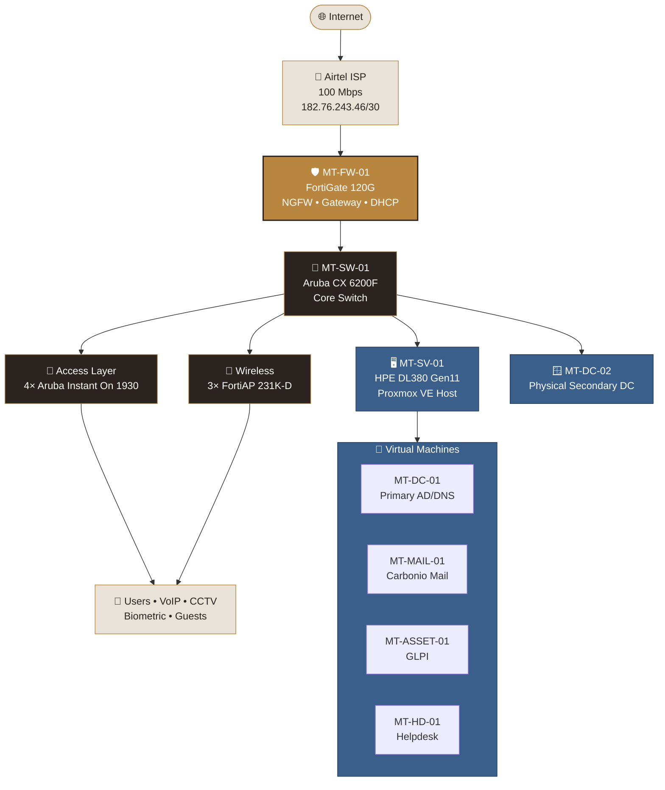
```mermaid
flowchart TB
    INET(["🌐 Internet"])
    ISP["🔗 Airtel ISP<br/>100 Mbps<br/>182.76.243.46/30"]
    FW["🛡️ MT-FW-01<br/>FortiGate 120G<br/>NGFW • Gateway • DHCP"]
    CORE["🔀 MT-SW-01<br/>Aruba CX 6200F<br/>Core Switch"]
    ACCESS["🔌 Access Layer<br/>4× Aruba Instant On 1930"]
    WIFI["📶 Wireless<br/>3× FortiAP 231K-D"]
    SRV["🖥️ MT-SV-01<br/>HPE DL380 Gen11<br/>Proxmox VE Host"]
    DC2["🪟 MT-DC-02<br/>Physical Secondary DC"]
    subgraph VMS["🧱 Virtual Machines"]
        VDC1["MT-DC-01<br/>Primary AD/DNS"]
        VMAIL["MT-MAIL-01<br/>Carbonio Mail"]
        VASSET["MT-ASSET-01<br/>GLPI"]
        VHD["MT-HD-01<br/>Helpdesk"]
    end
    USERS["👥 Users • VoIP • CCTV<br/>Biometric • Guests"]

    INET --> ISP --> FW
    FW --> CORE
    CORE --> ACCESS
    CORE --> WIFI
    CORE --> SRV
    CORE --> DC2
    SRV --> VMS
    ACCESS --> USERS
    WIFI --> USERS

    classDef fw fill:#b8863f,stroke:#2b2320,color:#fff,stroke-width:2px;
    classDef net fill:#2b2320,stroke:#b8863f,color:#fff;
    classDef srv fill:#3a5f8a,stroke:#1e3a5f,color:#fff;
    classDef cloud fill:#e8e2d8,stroke:#b8863f,color:#2b2320;
    class FW fw;
    class CORE,ACCESS,WIFI net;
    class SRV,DC2,VMS srv;
    class INET,ISP,USERS cloud;
```

### 2.3 Environment Summary Table

| Layer | Component | Count | Role |
|-------|-----------|:-----:|------|
| **Perimeter** | FortiGate 120G | 1 | NGFW, routing, DHCP, WAN edge |
| **Core** | Aruba CX 6200F-24G PoE | 1 | Layer 2 aggregation, PoE |
| **Access** | Aruba Instant On 1930 | 4 | Edge port connectivity, PoE |
| **Wireless** | FortiAP 231K-D | 3 | Wi-Fi 6E access points |
| **Compute** | HPE ProLiant DL380 Gen11 | 1 | Virtualization host |
| **Identity** | Windows Domain Controllers | 2 | AD DS + DNS (1 virtual, 1 physical) |
| **Applications** | GLPI, Helpdesk, Carbonio | 3 | ITSM, asset mgmt, collaboration |
| **Network Segments** | VLANs | 8 | Segmentation & isolation |

### 2.4 Design Standards Referenced

This design aligns with the following industry frameworks and vendor best practices:

- **Fortinet** Secure Networking & FortiGate Hardening Guides
- **HPE Aruba** Validated Reference Architecture (Campus)
- **Microsoft** Active Directory Domain Services best practices
- **NIST SP 800-series** (security control alignment) 🟡 `[ASSUMPTION — VALIDATE]`
- **ISO/IEC 27001:2022** control mapping (aspirational) 🟡 `[ASSUMPTION — VALIDATE]`

<div style="page-break-after: always;"></div>

---

## 3. Business Requirements

### 3.1 Business Context

**Mathera Tech Pvt Ltd** is a technology company headquartered in Mandya, Karnataka. The infrastructure described herein supports the company's internal operations, staff productivity, collaboration, and IT service delivery for a workforce of **approximately 25–50 users across 1–2 floors** 🟡 `[ASSUMPTION — VALIDATE: exact headcount]`.

### 3.2 Business Drivers

| # | Business Driver | Infrastructure Response |
|---|-----------------|-------------------------|
| BD-1 | Secure, reliable internet access for all staff | FortiGate NGFW with UTM, segmented Wi-Fi |
| BD-2 | Centralized identity & access control | Active Directory with dual DCs |
| BD-3 | Professional corporate email | Carbonio Collaboration Suite (self-hosted) |
| BD-4 | Structured IT support & ticketing | Helpdesk platform |
| BD-5 | Accurate IT asset tracking | GLPI asset management |
| BD-6 | Physical security integration | Dedicated CCTV & Biometric VLANs |
| BD-7 | Guest connectivity without risk | Isolated Guest Wi-Fi with captive portal |
| BD-8 | Scalability for future growth | Modular switching, virtualization headroom |

### 3.3 Functional Requirements

- **FR-1** — All users authenticate against a central directory (Active Directory).
- **FR-2** — Email must be accessible internally and externally via `mail.matheratech.in` over HTTPS.
- **FR-3** — IT assets and support tickets tracked via web applications (GLPI, Helpdesk).
- **FR-4** — Wireless coverage across all occupied floors with separate corporate and guest access.
- **FR-5** — Physical security systems (CCTV, biometric) isolated on dedicated segments.
- **FR-6** — VoIP-ready network with a dedicated voice segment and QoS. 🟡 `[ASSUMPTION — VALIDATE: VoIP platform]`

### 3.4 Non-Functional Requirements

| Category | Requirement | Target |
|----------|-------------|--------|
| **Availability** | Core network & identity uptime | 99.5% 🟡 `[ASSUMPTION — VALIDATE]` |
| **Performance** | Internet throughput | 100 Mbps sustained |
| **Security** | Inter-segment traffic | Default-deny, firewall-inspected |
| **Scalability** | User growth headroom | +50% without redesign |
| **Recoverability** | RPO (target) | ≤ 24 hours 🟡 `[ASSUMPTION — VALIDATE]` |
| **Recoverability** | RTO (target) | ≤ 8 hours 🟡 `[ASSUMPTION — VALIDATE]` |
| **Manageability** | Centralized management | Per-vendor consoles |

### 3.5 Constraints & Assumptions

- **C-1** — Single physical site; no secondary/DR site currently exists.
- **C-2** — Single internet link (Airtel) at time of writing; secondary ISP pending.
- **C-3** — Lean IT team; solutions must favor operational simplicity.
- **C-4** — Backup infrastructure not yet procured (addressed as a recommendation).

<div style="page-break-after: always;"></div>

---

## 4. Scope

### 4.1 In Scope

This document covers the design, configuration baseline, and operation of:

✅ Perimeter firewall (FortiGate 120G) — policy, routing, NAT, UTM, VPN
✅ Core & access switching (Aruba CX + Instant On)
✅ Wireless infrastructure (FortiAP)
✅ Server hardware (HPE DL380 Gen11) & out-of-band management (iLO)
✅ Virtualization platform (Proxmox VE)
✅ Active Directory & DNS design
✅ VLAN & IP addressing architecture
✅ Application services (Carbonio, GLPI, Helpdesk)
✅ Security architecture & GPO baseline
✅ Backup, DR, HA, and monitoring designs (target-state)
✅ Operational runbooks, change & maintenance procedures

### 4.2 Out of Scope

The following are explicitly **excluded** from this document:

❌ Application-level administration internals (e.g., GLPI plugin development)
❌ End-user device (laptop/desktop) build standards 🟡 `[ASSUMPTION — VALIDATE]`
❌ Telephony/PBX system design (dedicated VLAN provided; platform TBD)
❌ CCTV/NVR vendor configuration (network segment provided only)
❌ Software licensing procurement & commercial terms
❌ Physical construction, electrical, and civil works

### 4.3 Scope Boundary Diagram


```mermaid
flowchart LR
    subgraph INSCOPE["✅ IN SCOPE"]
        direction TB
        A["Network & Security"]
        B["Compute & Virtualization"]
        C["Identity & DNS"]
        D["Core Applications"]
        E["Ops & Governance"]
    end
    subgraph OUTSCOPE["❌ OUT OF SCOPE"]
        direction TB
        F["Endpoint Builds"]
        G["PBX / Telephony"]
        H["CCTV Vendor Config"]
        I["Licensing / Procurement"]
    end
    INSCOPE -.boundary.- OUTSCOPE
    classDef in fill:#e3f0e3,stroke:#2e7d32,color:#1b3a1b;
    classDef out fill:#f5e3e3,stroke:#c62828,color:#3a1b1b;
    class INSCOPE,A,B,C,D,E in;
    class OUTSCOPE,F,G,H,I out;
```

<div style="page-break-after: always;"></div>

---

## 5. Hardware Inventory

### 5.1 Complete Device Register

| # | Hostname | Device Type | Model | Mgmt IP | Location | Role |
|:-:|----------|-------------|-------|---------|----------|------|
| 1 | **MT-FW-01** | Firewall | Fortinet FortiGate 120G | 192.168.10.1 | Rack U32 | Perimeter NGFW / Gateway |
| 2 | **MT-SW-01** | Core Switch | Aruba CX 6200F-24G PoE | 192.168.10.2 | Rack U30 | L2/L3 Core Aggregation |
| 3 | **MT-SW-02** | Access Switch | Aruba Instant On 1930 (JL682A) | 192.168.10.11 | Rack U28 | Edge Access |
| 4 | **MT-SW-03** | Access Switch | Aruba Instant On 1930 (JL682A) | 192.168.10.12 | Rack U27 | Edge Access |
| 5 | **MT-SW-04** | Access Switch | Aruba Instant On 1930 (JL682A) | 192.168.10.13 | Rack U26 | Edge Access |
| 6 | **MT-SW-05** | Access Switch | Aruba Instant On 1930 (JL682A) | 192.168.10.14 | Rack U25 | Edge Access |
| 7 | **MT-AP-01** | Wireless AP | FortiAP 231K-D | via FortiLink (DHCP) | Floor 1 🟡 | Wi-Fi Access |
| 8 | **MT-AP-02** | Wireless AP | FortiAP 231K-D | via FortiLink (DHCP) | Floor 1/2 🟡 | Wi-Fi Access |
| 9 | **MT-AP-03** | Wireless AP | FortiAP 231K-D | via FortiLink (DHCP) | Floor 2 🟡 | Wi-Fi Access |
| 10 | **MT-SV-01** | Server | HPE ProLiant DL380 Gen11 | iLO: 192.168.20.51 | Rack U18–19 | Virtualization Host |
| 11 | **MT-DC-02** | Server (Physical) | 🟡 `[VALIDATE model]` | 192.168.30.6 | Rack U16 🟡 | Physical Secondary DC |

> 🟡 **`[ASSUMPTION — VALIDATE]`** — AP physical placement, rack U-positions, and the physical host model for MT-DC-02 are best-practice defaults. MT-DC-02 is confirmed **physical**; its server model/spec was not supplied — confirm and update. Note the FortiAPs draw PoE from access switches and receive an IP on VLAN 10 via FortiLink DHCP.

### 5.2 Firewall — MT-FW-01

| Attribute | Specification |
|-----------|---------------|
| **Model** | Fortinet FortiGate 120G |
| **Firmware** | FortiOS 7.4.x 🟡 `[ASSUMPTION — VALIDATE]` |
| **Interfaces** | 10× GE RJ45, 8× GE SFP, 2× 10GE SFP+ (typical for 120G) |
| **Throughput** | Firewall 22 Gbps / Threat Protection ~1 Gbps |
| **Role** | NGFW, default gateway (all VLANs), DHCP server, SSL-VPN, FortiLink controller |
| **Management IP** | 192.168.10.1 (VLAN 10) |
| **Licensing** | FortiCare + FortiGuard UTM Bundle 🟡 `[ASSUMPTION — VALIDATE]` |
| **HA** | Standalone (no HA pair) — see §28 |

### 5.3 Core Switch — MT-SW-01

| Attribute | Specification |
|-----------|---------------|
| **Model** | Aruba CX 6200F-24G PoE (JL725A class) |
| **Ports** | 24× 1GbE PoE+ + 4× 1/10GbE SFP+ uplinks |
| **PoE Budget** | ~370 W 🟡 `[ASSUMPTION — VALIDATE]` |
| **Role** | Layer 2 core aggregation, VLAN trunking to FortiGate |
| **Management IP** | 192.168.10.2 (VLAN 10) |
| **AOS-CX** | 10.x 🟡 `[ASSUMPTION — VALIDATE]` |

### 5.4 Access Switches — MT-SW-02 to MT-SW-05

| Attribute | Specification |
|-----------|---------------|
| **Model** | Aruba Instant On 1930 (JL682A) — 24-port GbE PoE+ Smart-Managed |
| **PoE Budget** | 195 W per switch |
| **Uplinks** | SFP/SFP+ to core |
| **Role** | End-user, VoIP, AP, CCTV, biometric edge connectivity |
| **Management** | 192.168.10.11–14 (VLAN 10) |

### 5.5 Wireless Access Points — MT-AP-01 to MT-AP-03

| Attribute | Specification |
|-----------|---------------|
| **Model** | FortiAP 231K-D |
| **Standard** | Wi-Fi 6E (802.11ax, tri-band) |
| **Radios** | 2.4 / 5 / 6 GHz |
| **Management** | FortiGate-managed via FortiLink (CAPWAP) |
| **Power** | PoE+ (802.3at) from access switches |
| **SSIDs** | Corporate (WPA2/3-Enterprise) + Guest (captive portal) |

### 5.6 Server — MT-SV-01

| Attribute | Specification |
|-----------|---------------|
| **Model** | HPE ProLiant DL380 Gen11 (2U rack) |
| **CPU** | 2× Intel Xeon Scalable (4th Gen) 🟡 `[ASSUMPTION — VALIDATE]` |
| **RAM** | 128 GB DDR5 ECC 🟡 `[ASSUMPTION — VALIDATE]` |
| **Storage** | RAID-10, SSD/SAS via HPE Smart Array 🟡 `[ASSUMPTION — VALIDATE]` |
| **Network** | 4× 1GbE + optional 10GbE OCP 🟡 `[ASSUMPTION — VALIDATE]` |
| **Power** | Dual redundant PSU (recommended) 🟡 `[ASSUMPTION — VALIDATE]` |
| **Out-of-Band** | HPE iLO 6 — 192.168.20.51 🟡 `[recommend relocating to VLAN 10]` |
| **Hypervisor** | Proxmox VE (MT-PVE-01) |

### 5.7 Warranty & Support Summary

🟡 `[ASSUMPTION — VALIDATE: all warranty dates and contract IDs below are placeholders]`

| Device | Vendor | Support Contract | Coverage | Start | End |
|--------|--------|------------------|----------|-------|-----|
| MT-FW-01 | Fortinet | FortiCare Premium | 24×7 | TBD | TBD |
| MT-SW-01 | HPE Aruba | Aruba Foundation Care | NBD | TBD | TBD |
| MT-SW-02–05 | HPE Aruba | Instant On Ltd. Lifetime | RMA | TBD | TBD |
| MT-AP-01–03 | Fortinet | FortiCare | 24×7 | TBD | TBD |
| MT-SV-01 | HPE | HPE Pointnext Tech Care | 24×7×4h 🟡 | TBD | TBD |

> 📌 Populate this table from vendor portals: **Fortinet Support** (support.fortinet.com), **HPE Support Center** (support.hpe.com), **Aruba Support Portal**.

<div style="page-break-after: always;"></div>

---

## 6. Software Inventory

### 6.1 Operating Systems & Platforms

| System | Software | Version | Licensing | Host |
|--------|----------|---------|-----------|------|
| MT-PVE-01 | Proxmox VE | 8.x 🟡 | Community/Subscription 🟡 | MT-SV-01 (bare metal) |
| MT-DC-01 | Windows Server | 2022 Standard 🟡 | Volume/OEM 🟡 | VM on MT-PVE-01 |
| MT-DC-02 | Windows Server | 2022 Standard 🟡 | Volume/OEM 🟡 | Physical |
| MT-MAIL-01 | Ubuntu Server LTS | 22.04 🟡 | Open Source | VM on MT-PVE-01 |
| MT-ASSET-01 | Debian/Ubuntu | 12 / 22.04 🟡 | Open Source | VM on MT-PVE-01 |
| MT-HD-01 | Ubuntu Server LTS | 22.04 🟡 | Open Source | VM on MT-PVE-01 |

### 6.2 Application Software

| Application | Product | Version | Purpose | URL |
|-------------|---------|---------|---------|-----|
| Mail / Collaboration | Carbonio (Zextras) CE | Latest 🟡 | Email, calendar, contacts | https://mail.matheratech.in |
| Asset Management | GLPI | 10.x 🟡 | IT asset & inventory | https://assets.matheratech.in |
| Helpdesk / ITSM | Helpdesk 🟡 `[VALIDATE product]` | — | Ticketing & support | https://helpdesk.matheratech.in |
| Directory | AD DS + DNS | WS2022 | Identity & name resolution | Internal |
| Virtualization | Proxmox VE | 8.x | Compute virtualization | https://ve.matheratech.in:8006 |

### 6.3 Security & Management Software

| Category | Product | Notes |
|----------|---------|-------|
| NGFW OS | FortiOS 7.4.x 🟡 | UTM: IPS, AV, Web Filter, App Control |
| AP Management | FortiLink (integrated in FortiOS) | CAPWAP AP control |
| Switch Mgmt | Aruba AOS-CX / Instant On Cloud 🟡 | Per-vendor consoles |
| Server OOB | HPE iLO 6 | Remote lifecycle management |
| Backup | **Not deployed** 🔴 | Recommend Proxmox Backup Server — §26 |
| Monitoring | **Not deployed** 🔴 | Recommend Zabbix/PRTG — §29 |
| Endpoint Protection | 🟡 `[VALIDATE — EDR/AV product]` | Recommend Microsoft Defender/FortiClient |

### 6.4 Licensing Posture Summary

> ⚠️ **Action:** Confirm and centrally record all license keys, subscription expiry dates, and entitlement counts (FortiGuard bundle, Windows Server CALs, Proxmox subscription). Track renewals in GLPI (§30) to prevent lapse of security signatures or support.

<div style="page-break-after: always;"></div>

---

## 7. Virtualization Architecture

### 7.1 Overview

Mathera Tech consolidates its server workloads onto a single **Proxmox VE** host (**MT-PVE-01**) running on the **HPE ProLiant DL380 Gen11**. Proxmox VE is an enterprise-grade, open-source virtualization platform combining KVM (for VMs) and LXC (for containers) under a unified web management interface.

A deliberate design decision keeps the **secondary domain controller (MT-DC-02) physical**, entirely independent of the hypervisor, so that identity and authentication services survive a total failure of the virtualization host.

### 7.2 Virtualization Design Principles

| Principle | Implementation |
|-----------|----------------|
| **Consolidation** | All application workloads virtualized on one high-spec host |
| **Isolation** | Each service in its own dedicated VM |
| **Identity Resilience** | Secondary DC deliberately kept on physical hardware |
| **Management** | Centralized Proxmox web UI at `ve.matheratech.in:8006` |
| **Segmentation** | VLAN-aware Linux bridge maps VMs to correct VLANs |

### 7.3 Proxmox Virtualization Architecture

> **Diagram 15 — Proxmox Virtualization Architecture**

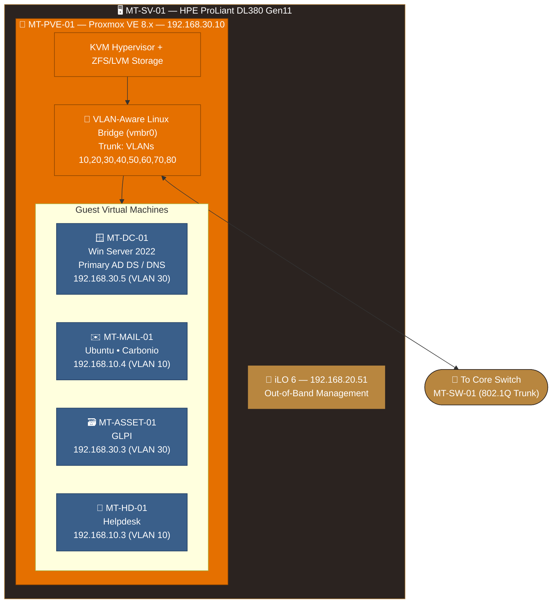
```mermaid
flowchart TB
    subgraph HW["🖥️ MT-SV-01 — HPE ProLiant DL380 Gen11"]
        direction TB
        ILO["🔧 iLO 6 — 192.168.20.51<br/>Out-of-Band Management"]
        subgraph PVE["🧱 MT-PVE-01 — Proxmox VE 8.x — 192.168.30.10"]
            direction TB
            KERNEL["KVM Hypervisor + ZFS/LVM Storage"]
            BRIDGE["🌉 VLAN-Aware Linux Bridge (vmbr0)<br/>Trunk: VLANs 10,20,30,40,50,60,70,80"]
            subgraph GUESTS["Guest Virtual Machines"]
                VM1["🪟 MT-DC-01<br/>Win Server 2022<br/>Primary AD DS / DNS<br/>192.168.30.5 (VLAN 30)"]
                VM2["✉️ MT-MAIL-01<br/>Ubuntu • Carbonio<br/>192.168.10.4 (VLAN 10)"]
                VM3["🗃️ MT-ASSET-01<br/>GLPI<br/>192.168.30.3 (VLAN 30)"]
                VM4["🎫 MT-HD-01<br/>Helpdesk<br/>192.168.10.3 (VLAN 10)"]
            end
        end
    end
    KERNEL --> BRIDGE
    BRIDGE --> GUESTS
    NET(["🔀 To Core Switch<br/>MT-SW-01 (802.1Q Trunk)"])
    BRIDGE <--> NET

    classDef host fill:#2b2320,stroke:#b8863f,color:#fff;
    classDef pve fill:#e57000,stroke:#8a4400,color:#fff;
    classDef vm fill:#3a5f8a,stroke:#1e3a5f,color:#fff;
    classDef mgmt fill:#b8863f,stroke:#2b2320,color:#fff;
    class HW host;
    class PVE,KERNEL,BRIDGE pve;
    class VM1,VM2,VM3,VM4 vm;
    class ILO,NET mgmt;
```

### 7.4 Virtual Machine Allocation

🟡 `[ASSUMPTION — VALIDATE: per-VM resource allocations below are best-practice sizing]`

| VM | vCPU | RAM | Disk | VLAN | OS | Role |
|----|:----:|:---:|:----:|:----:|----|------|
| MT-DC-01 | 2 | 4 GB | 80 GB | 30 | WS2022 | Primary AD DS/DNS |
| MT-MAIL-01 | 4 | 8 GB | 200 GB | 10 | Ubuntu | Carbonio Mail |
| MT-ASSET-01 | 2 | 4 GB | 60 GB | 30 | Debian | GLPI |
| MT-HD-01 | 2 | 4 GB | 60 GB | 10 | Ubuntu | Helpdesk |
| **Totals** | **10** | **20 GB** | **400 GB** | — | — | — |

> 💡 With a 128 GB host, ample headroom (~100 GB RAM) remains for growth, additional VMs, and Proxmox overhead.

### 7.5 Storage Design

| Aspect | Design |
|--------|--------|
| **Local Storage** | HPE Smart Array RAID-10 volume presented to Proxmox 🟡 |
| **Storage Type** | ZFS (recommended — snapshots, integrity) or LVM-Thin 🟡 |
| **VM Disks** | `.qcow2`/ZFS zvol thin-provisioned |
| **Snapshots** | Enabled for pre-change rollback |
| **Backup Target** | 🔴 Not configured — see §26 (Proxmox Backup Server recommended) |

### 7.6 Virtualization Risks

> 🔴 **Single Host = Single Point of Failure.** All virtualized workloads (including the primary DC) run on one physical server. A hardware failure of MT-SV-01 takes down mail, ITSM, and the primary DC simultaneously. **Mitigation:** the physical MT-DC-02 maintains authentication; however, a second Proxmox node + cluster (or at minimum PBS backups with a rapid restore host) is strongly recommended — see §28.

<div style="page-break-after: always;"></div>

---

## 8. Active Directory Architecture

### 8.1 Overview

Identity and access management is delivered by **Microsoft Active Directory Domain Services (AD DS)** across **two domain controllers**, providing authentication, authorization, group policy, and integrated DNS for the domain **`matheratech.in`**.

| Attribute | Value |
|-----------|-------|
| **Forest / Domain (FQDN)** | `matheratech.in` |
| **NetBIOS Name** | MATHERATECH 🟡 `[ASSUMPTION — VALIDATE]` |
| **Forest Functional Level** | Windows Server 2016+ 🟡 `[ASSUMPTION — VALIDATE]` |
| **Domain Functional Level** | Windows Server 2016+ 🟡 `[ASSUMPTION — VALIDATE]` |
| **Primary DC** | MT-DC-01 — 192.168.30.5 (Virtual) |
| **Secondary DC** | MT-DC-02 — 192.168.30.6 (Physical) |
| **Global Catalog** | Both DCs 🟡 (recommended) |

> 📌 **Note on domain naming:** Using the public domain `matheratech.in` as the internal AD domain (a "split-brain" DNS model) is a valid, common pattern. It requires careful DNS management so internal clients resolve internal service IPs while external clients resolve public IPs. This is fully addressed in §9 and §22.

### 8.2 Domain Controller Roles

| Role | MT-DC-01 (Virtual) | MT-DC-02 (Physical) |
|------|:------------------:|:-------------------:|
| AD DS | ✅ Primary | ✅ Secondary |
| DNS Server | ✅ | ✅ |
| Global Catalog | ✅ | ✅ |
| DHCP | ❌ (FortiGate serves DHCP) | ❌ |
| **FSMO Roles** | ✅ All 5 🟡 | Standby |

**FSMO Role Placement** 🟡 `[ASSUMPTION — VALIDATE]` — all five FSMO roles (Schema Master, Domain Naming Master, RID Master, PDC Emulator, Infrastructure Master) reside on **MT-DC-01**. In a two-DC design this is acceptable; ensure MT-DC-02 is a viable seizure target for DR.

### 8.3 Active Directory Replication Diagram

> **Diagram 7 — Active Directory Replication**

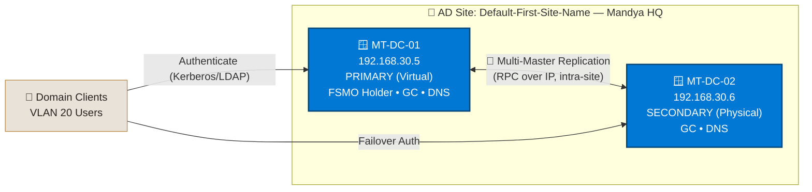
```mermaid
flowchart LR
    subgraph SITE["🏢 AD Site: Default-First-Site-Name — Mandya HQ"]
        direction LR
        DC1["🪟 MT-DC-01<br/>192.168.30.5<br/>PRIMARY (Virtual)<br/>FSMO Holder • GC • DNS"]
        DC2["🪟 MT-DC-02<br/>192.168.30.6<br/>SECONDARY (Physical)<br/>GC • DNS"]
        DC1 <-->|"🔄 Multi-Master Replication<br/>(RPC over IP, intra-site)"| DC2
    end
    CLIENTS["👥 Domain Clients<br/>VLAN 20 Users"]
    CLIENTS -->|"Authenticate (Kerberos/LDAP)"| DC1
    CLIENTS -->|"Failover Auth"| DC2

    classDef dc fill:#0078d4,stroke:#004578,color:#fff,stroke-width:2px;
    classDef site fill:#eaf3fb,stroke:#0078d4,color:#00335c;
    classDef cli fill:#e8e2d8,stroke:#b8863f,color:#2b2320;
    class DC1,DC2 dc;
    class CLIENTS cli;
```

### 8.4 Organizational Unit (OU) Structure

🟡 `[ASSUMPTION — VALIDATE: recommended OU design]`

```
matheratech.in
├── OU=MatheraTech
│   ├── OU=Users
│   │   ├── OU=IT
│   │   ├── OU=Management
│   │   └── OU=Staff
│   ├── OU=Computers
│   │   ├── OU=Workstations
│   │   └── OU=Servers
│   ├── OU=Groups
│   │   ├── OU=Security-Groups
│   │   └── OU=Distribution-Groups
│   └── OU=ServiceAccounts
```

### 8.5 Authentication Flow

> **Diagram 9 — Authentication Flow (Kerberos)**

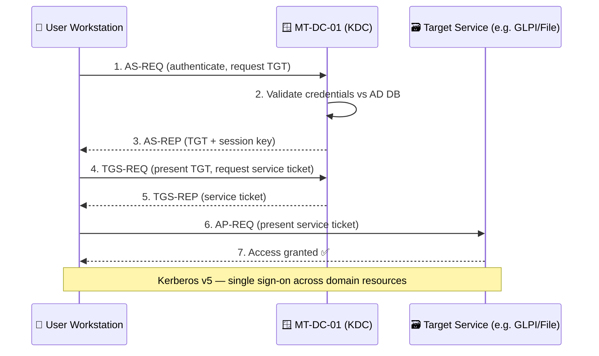
```mermaid
sequenceDiagram
    participant U as 👤 User Workstation
    participant DC as 🪟 MT-DC-01 (KDC)
    participant S as 🗃️ Target Service (e.g. GLPI/File)
    U->>DC: 1. AS-REQ (authenticate, request TGT)
    DC->>DC: 2. Validate credentials vs AD DB
    DC-->>U: 3. AS-REP (TGT + session key)
    U->>DC: 4. TGS-REQ (present TGT, request service ticket)
    DC-->>U: 5. TGS-REP (service ticket)
    U->>S: 6. AP-REQ (present service ticket)
    S-->>U: 7. Access granted ✅
    Note over U,S: Kerberos v5 — single sign-on across domain resources
```

### 8.6 User Login Flow

> **Diagram 10 — User Login Flow**

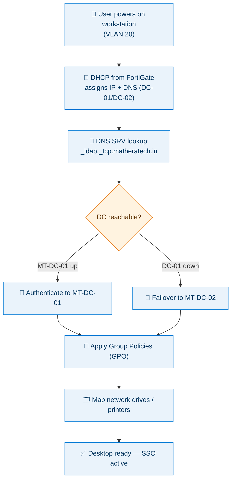
```mermaid
flowchart TD
    A["👤 User powers on workstation<br/>(VLAN 20)"] --> B["🔌 DHCP from FortiGate<br/>assigns IP + DNS (DC-01/DC-02)"]
    B --> C["🔎 DNS SRV lookup:<br/>_ldap._tcp.matheratech.in"]
    C --> D{"DC reachable?"}
    D -->|"MT-DC-01 up"| E["🔐 Authenticate to MT-DC-01"]
    D -->|"DC-01 down"| F["🔐 Failover to MT-DC-02"]
    E --> G["📜 Apply Group Policies (GPO)"]
    F --> G
    G --> H["🗂️ Map network drives / printers"]
    H --> I["✅ Desktop ready — SSO active"]

    classDef step fill:#eaf3fb,stroke:#0078d4,color:#00335c;
    classDef dec fill:#fff3e0,stroke:#e57000,color:#5c3000;
    class A,B,C,E,F,G,H,I step;
    class D dec;
```

<div style="page-break-after: always;"></div>

---

## 9. DNS Architecture

### 9.1 Overview

DNS is central to the operation of Active Directory and application access. Mathera Tech operates a **split-brain (split-horizon) DNS** model:

- **Internal DNS** — Authoritative for `matheratech.in` inside the LAN, hosted on the AD-integrated DNS on **MT-DC-01** and **MT-DC-02**. Resolves service names to **private** IPs.
- **External (Public) DNS** — Hosted at the public registrar/DNS provider 🟡 `[VALIDATE provider]`. Resolves public-facing names (e.g., `mail.matheratech.in`) to the **public** IP (182.76.243.46) for external users.

### 9.2 DNS Resolution Design

| Query Origin | Resolver | Example | Resolves To |
|--------------|----------|---------|-------------|
| Internal client | MT-DC-01 / MT-DC-02 | mail.matheratech.in | 192.168.10.4 (private) |
| Internal client | DC → Forwarders | google.com | External (via forwarder) |
| External client | Public DNS | mail.matheratech.in | 182.76.243.46 (public NAT) |

**DNS Forwarders** 🟡 `[ASSUMPTION — VALIDATE]` — DCs forward external queries to secure upstream resolvers (e.g., FortiGate DNS, `1.1.1.1`, `8.8.8.8`). Recommend enabling DNS filtering via FortiGuard.

### 9.3 DNS Flow Diagram

> **Diagram 8 — DNS Resolution Flow**

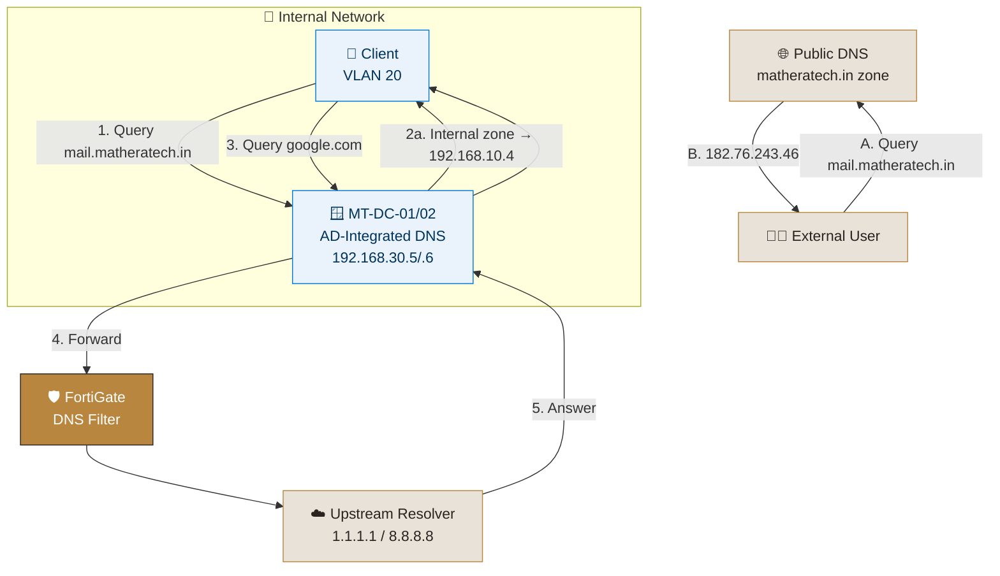
```mermaid
flowchart TD
    subgraph INTERNAL["🏢 Internal Network"]
        CLIENT["👤 Client<br/>VLAN 20"]
        DC["🪟 MT-DC-01/02<br/>AD-Integrated DNS<br/>192.168.30.5/.6"]
    end
    FW["🛡️ FortiGate<br/>DNS Filter"]
    FWD["☁️ Upstream Resolver<br/>1.1.1.1 / 8.8.8.8"]
    PUB["🌐 Public DNS<br/>matheratech.in zone"]
    EXT["🧑‍💻 External User"]

    CLIENT -->|"1. Query mail.matheratech.in"| DC
    DC -->|"2a. Internal zone → 192.168.10.4"| CLIENT
    CLIENT -->|"3. Query google.com"| DC
    DC -->|"4. Forward"| FW --> FWD
    FWD -->|"5. Answer"| DC --> CLIENT

    EXT -->|"A. Query mail.matheratech.in"| PUB
    PUB -->|"B. 182.76.243.46"| EXT

    classDef int fill:#eaf3fb,stroke:#0078d4,color:#00335c;
    classDef ext fill:#e8e2d8,stroke:#b8863f,color:#2b2320;
    classDef fw fill:#b8863f,stroke:#2b2320,color:#fff;
    class CLIENT,DC int;
    class PUB,EXT,FWD ext;
    class FW fw;
```

### 9.4 DNS Zones

| Zone | Type | Hosted On | Purpose |
|------|------|-----------|---------|
| `matheratech.in` | AD-Integrated Primary | MT-DC-01, MT-DC-02 | Internal forward lookup |
| `30.168.192.in-addr.arpa` | AD-Integrated Reverse | MT-DC-01, MT-DC-02 | Server reverse lookup 🟡 |
| `20.168.192.in-addr.arpa` | AD-Integrated Reverse | MT-DC-01, MT-DC-02 | User reverse lookup 🟡 |
| `matheratech.in` (public) | Public Primary | Registrar/DNS provider 🟡 | External resolution |

> 💡 **Best Practice:** Enable **scavenging** of stale DNS records, configure **reverse lookup zones** for all server subnets, and ensure both DCs are listed as DNS servers in DHCP options (primary + secondary) for redundancy.

<div style="page-break-after: always;"></div>

---

## 10. Network Topology

### 10.1 Overview

The Mathera Tech network follows a **collapsed-core / firewall-on-a-stick** topology optimized for a single-site deployment of this size. The FortiGate 120G serves as the routing and security core, the Aruba CX 6200F provides Layer 2 aggregation, and four Aruba Instant On switches deliver edge access. All inter-VLAN routing traverses the FortiGate, ensuring every east-west flow is inspected.

### 10.2 Complete Enterprise Infrastructure Diagram

> **Diagram 20 — Complete Enterprise Infrastructure**

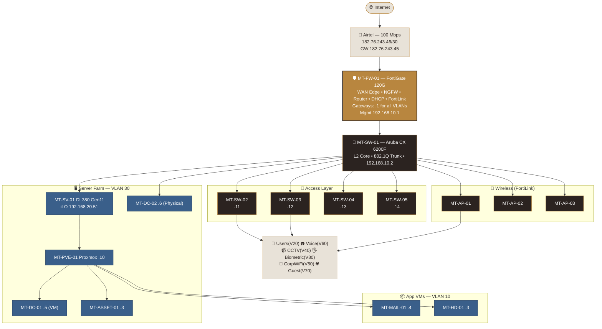
```mermaid
flowchart TB
    INET(["🌐 Internet"])
    ISP["🔗 Airtel — 100 Mbps<br/>182.76.243.46/30<br/>GW 182.76.243.45"]
    FW["🛡️ MT-FW-01 — FortiGate 120G<br/>WAN Edge • NGFW • Router • DHCP • FortiLink<br/>Gateways: .1 for all VLANs<br/>Mgmt 192.168.10.1"]
    CORE["🔀 MT-SW-01 — Aruba CX 6200F<br/>L2 Core • 802.1Q Trunk • 192.168.10.2"]

    subgraph ACC["🔌 Access Layer"]
        SW2["MT-SW-02<br/>.11"]
        SW3["MT-SW-03<br/>.12"]
        SW4["MT-SW-04<br/>.13"]
        SW5["MT-SW-05<br/>.14"]
    end

    subgraph WLAN["📶 Wireless (FortiLink)"]
        AP1["MT-AP-01"]
        AP2["MT-AP-02"]
        AP3["MT-AP-03"]
    end

    subgraph SRVFARM["🖥️ Server Farm — VLAN 30"]
        SV["MT-SV-01 DL380 Gen11<br/>iLO 192.168.20.51"]
        PVE["MT-PVE-01 Proxmox .10"]
        DC1["MT-DC-01 .5 (VM)"]
        DC2["MT-DC-02 .6 (Physical)"]
        GLPI["MT-ASSET-01 .3"]
    end

    subgraph APPS["📦 App VMs — VLAN 10"]
        MAIL["MT-MAIL-01 .4"]
        HD["MT-HD-01 .3"]
    end

    ENDPOINTS["👥 Users(V20) ☎️ Voice(V60)<br/>📹 CCTV(V40) 🖐️ Biometric(V80)<br/>📶 CorpWiFi(V50) 🌐 Guest(V70)"]

    INET --> ISP --> FW --> CORE
    CORE --> SW2 & SW3 & SW4 & SW5
    CORE --> AP1 & AP2 & AP3
    CORE --> SV
    SV --> PVE --> DC1 & MAIL & GLPI & HD
    CORE --> DC2
    SW2 --> ENDPOINTS
    SW3 --> ENDPOINTS
    AP1 --> ENDPOINTS

    classDef fw fill:#b8863f,stroke:#2b2320,color:#fff,stroke-width:2px;
    classDef net fill:#2b2320,stroke:#b8863f,color:#fff;
    classDef srv fill:#3a5f8a,stroke:#1e3a5f,color:#fff;
    classDef cloud fill:#e8e2d8,stroke:#b8863f,color:#2b2320;
    class FW fw;
    class CORE,SW2,SW3,SW4,SW5,AP1,AP2,AP3 net;
    class SV,PVE,DC1,DC2,GLPI,MAIL,HD srv;
    class INET,ISP,ENDPOINTS cloud;
```

### 10.3 Layer 2 & Layer 3 Network Diagram

> **Diagram 3 — Layer 2 / Layer 3 Boundaries**

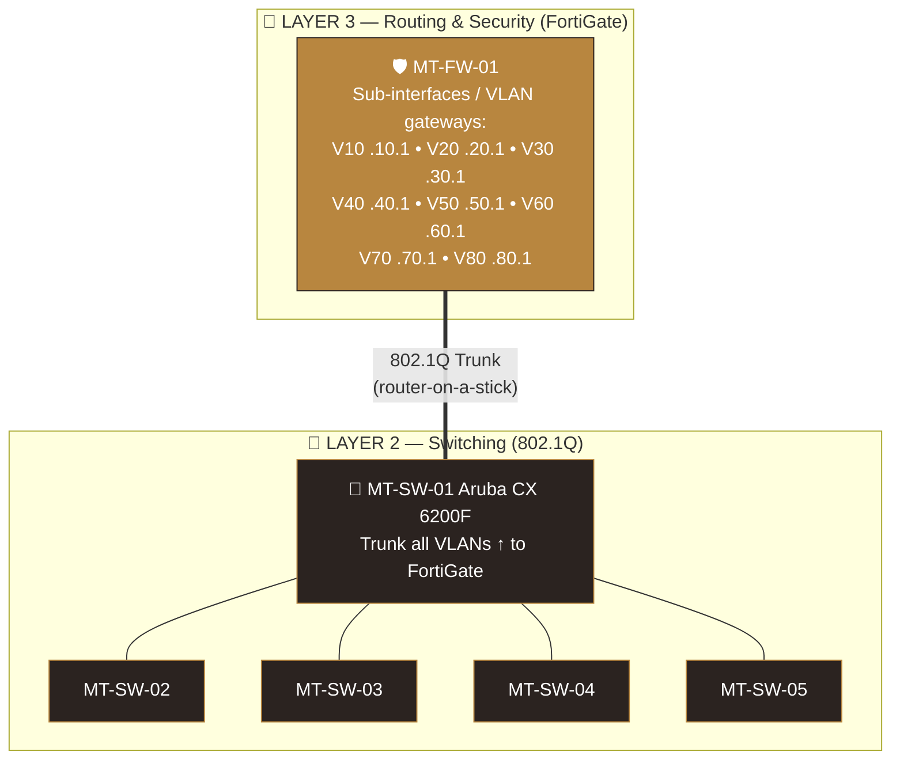
```mermaid
flowchart TB
    subgraph L3["🔷 LAYER 3 — Routing & Security (FortiGate)"]
        FWL3["🛡️ MT-FW-01<br/>Sub-interfaces / VLAN gateways:<br/>V10 .10.1 • V20 .20.1 • V30 .30.1<br/>V40 .40.1 • V50 .50.1 • V60 .60.1<br/>V70 .70.1 • V80 .80.1"]
    end
    subgraph L2["🔶 LAYER 2 — Switching (802.1Q)"]
        CORE["🔀 MT-SW-01 Aruba CX 6200F<br/>Trunk all VLANs ↑ to FortiGate"]
        SW2["MT-SW-02"]
        SW3["MT-SW-03"]
        SW4["MT-SW-04"]
        SW5["MT-SW-05"]
    end
    FWL3 ===|"802.1Q Trunk<br/>(router-on-a-stick)"| CORE
    CORE --- SW2 & SW3 & SW4 & SW5

    classDef l3 fill:#b8863f,stroke:#2b2320,color:#fff;
    classDef l2 fill:#2b2320,stroke:#b8863f,color:#fff;
    class FWL3 l3;
    class CORE,SW2,SW3,SW4,SW5 l2;
```

### 10.4 Traffic Flow Summary

| Flow Type | Path | Inspection |
|-----------|------|------------|
| Internet-bound | Client → Access SW → Core → FortiGate → ISP | NGFW + UTM |
| Inter-VLAN | Client → Core → FortiGate → Core → Dest VLAN | Firewall policy |
| Intra-VLAN | Client → Access SW → Core → Client | L2 switching (no FW) |
| Management | Admin → VLAN 10 → device mgmt IP | Restricted policy |

<div style="page-break-after: always;"></div>

---

## 11. Physical Topology

### 11.1 Physical Connectivity

All infrastructure is housed in a **single equipment rack** 🟡 `[ASSUMPTION — VALIDATE: rack room/location]` at the Mandya site. Devices are interconnected via structured Cat6/6A copper and fiber uplinks.

> **Diagram 2 — Physical Connectivity**

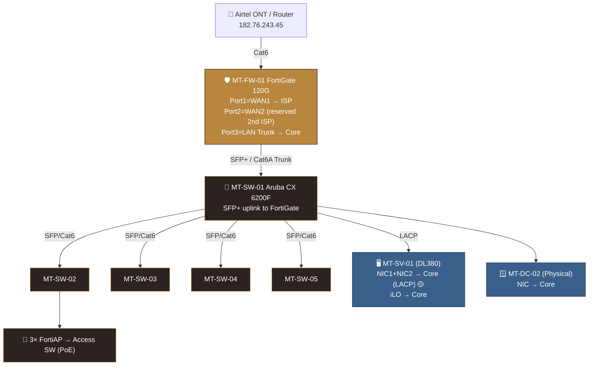
```mermaid
flowchart TB
    ISP["🔗 Airtel ONT / Router<br/>182.76.243.45"]
    FW["🛡️ MT-FW-01 FortiGate 120G<br/>Port1=WAN1 → ISP<br/>Port2=WAN2 (reserved 2nd ISP)<br/>Port3=LAN Trunk → Core"]
    CORE["🔀 MT-SW-01 Aruba CX 6200F<br/>SFP+ uplink to FortiGate"]
    SW2["MT-SW-02"]
    SW3["MT-SW-03"]
    SW4["MT-SW-04"]
    SW5["MT-SW-05"]
    SV["🖥️ MT-SV-01 (DL380)<br/>NIC1+NIC2 → Core (LACP) 🟡<br/>iLO → Core"]
    DC2["🪟 MT-DC-02 (Physical)<br/>NIC → Core"]
    AP["📶 3× FortiAP → Access SW (PoE)"]

    ISP -->|"Cat6"| FW
    FW -->|"SFP+ / Cat6A Trunk"| CORE
    CORE -->|"SFP/Cat6"| SW2 & SW3 & SW4 & SW5
    CORE -->|"LACP"| SV
    CORE --> DC2
    SW2 --> AP

    classDef fw fill:#b8863f,stroke:#2b2320,color:#fff;
    classDef net fill:#2b2320,stroke:#b8863f,color:#fff;
    classDef srv fill:#3a5f8a,stroke:#1e3a5f,color:#fff;
    class FW fw;
    class CORE,SW2,SW3,SW4,SW5,AP net;
    class SV,DC2 srv;
```

### 11.2 Physical Rack Layout / Rack Elevation

> **Diagram 19 — Rack Elevation (42U)** 🟡 `[ASSUMPTION — VALIDATE: exact U-positions]`

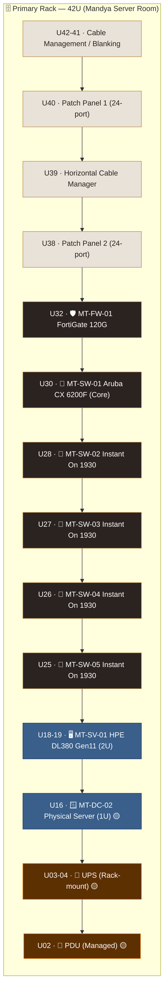
```mermaid
flowchart TB
    subgraph RACK["🗄️ Primary Rack — 42U (Mandya Server Room)"]
        direction TB
        U42["U42-41 · Cable Management / Blanking"]
        U40["U40 · Patch Panel 1 (24-port)"]
        U39["U39 · Horizontal Cable Manager"]
        U38["U38 · Patch Panel 2 (24-port)"]
        U32["U32 · 🛡️ MT-FW-01 FortiGate 120G"]
        U30["U30 · 🔀 MT-SW-01 Aruba CX 6200F (Core)"]
        U28["U28 · 🔌 MT-SW-02 Instant On 1930"]
        U27["U27 · 🔌 MT-SW-03 Instant On 1930"]
        U26["U26 · 🔌 MT-SW-04 Instant On 1930"]
        U25["U25 · 🔌 MT-SW-05 Instant On 1930"]
        U19["U18-19 · 🖥️ MT-SV-01 HPE DL380 Gen11 (2U)"]
        U16["U16 · 🪟 MT-DC-02 Physical Server (1U) 🟡"]
        U04["U03-04 · 🔋 UPS (Rack-mount) 🟡"]
        U02["U02 · 🔌 PDU (Managed) 🟡"]
    end
    U42 --> U40 --> U39 --> U38 --> U32 --> U30 --> U28 --> U27 --> U26 --> U25 --> U19 --> U16 --> U04 --> U02

    classDef net fill:#2b2320,stroke:#b8863f,color:#fff;
    classDef pwr fill:#5c3000,stroke:#e57000,color:#fff;
    classDef srv fill:#3a5f8a,stroke:#1e3a5f,color:#fff;
    classDef pass fill:#e8e2d8,stroke:#b8863f,color:#2b2320;
    class U32,U30,U28,U27,U26,U25 net;
    class U19,U16 srv;
    class U04,U02 pwr;
    class U42,U40,U39,U38 pass;
```

### 11.3 Rack Elevation Table

| U-Position | Device | Type | Notes |
|:----------:|--------|------|-------|
| U41–42 | Cable management | Passive | Top-of-rack |
| U40 | Patch Panel 1 | Passive | User drops |
| U39 | Horizontal manager | Passive | — |
| U38 | Patch Panel 2 | Passive | Server/uplinks |
| U32 | MT-FW-01 FortiGate 120G | Firewall | 1U |
| U30 | MT-SW-01 Aruba CX 6200F | Core switch | 1U |
| U25–28 | MT-SW-02–05 Instant On | Access switches | 1U each |
| U18–19 | MT-SV-01 HPE DL380 Gen11 | Server | 2U |
| U16 | MT-DC-02 Physical | Server | 1U 🟡 |
| U03–04 | UPS | Power | 🟡 model TBD |
| U02 | PDU | Power | 🟡 managed recommended |

> 🟡 `[ASSUMPTION — VALIDATE]` All U-positions, UPS, and PDU are recommended placements. Confirm actual rack layout, add a **UPS with ≥30 min runtime** and a **managed PDU** for remote power control if not present.

<div style="page-break-after: always;"></div>

---

## 12. Logical Topology

### 12.1 Logical Network Design

Logically, the network is divided into **eight isolated VLANs**, each representing a security zone. The FortiGate enforces a **default-deny** posture between zones, permitting only explicitly required flows.

> **Diagram — Logical Topology**

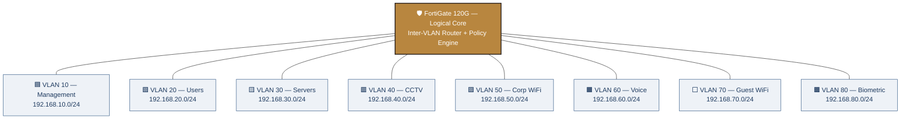
```mermaid
flowchart TB
    FW["🛡️ FortiGate 120G — Logical Core<br/>Inter-VLAN Router + Policy Engine"]
    V10["🟦 VLAN 10 — Management<br/>192.168.10.0/24"]
    V20["🟩 VLAN 20 — Users<br/>192.168.20.0/24"]
    V30["🟨 VLAN 30 — Servers<br/>192.168.30.0/24"]
    V40["🟥 VLAN 40 — CCTV<br/>192.168.40.0/24"]
    V50["🟪 VLAN 50 — Corp WiFi<br/>192.168.50.0/24"]
    V60["🟧 VLAN 60 — Voice<br/>192.168.60.0/24"]
    V70["⬜ VLAN 70 — Guest WiFi<br/>192.168.70.0/24"]
    V80["🟫 VLAN 80 — Biometric<br/>192.168.80.0/24"]

    FW --- V10 & V20 & V30 & V40 & V50 & V60 & V70 & V80

    classDef fw fill:#b8863f,stroke:#2b2320,color:#fff,stroke-width:2px;
    classDef vlan fill:#eef2f7,stroke:#3a5f8a,color:#1e3a5f;
    class FW fw;
    class V10,V20,V30,V40,V50,V60,V70,V80 vlan;
```

### 12.2 Logical Zones of Trust

| Zone | VLANs | Trust Level | Description |
|------|-------|:-----------:|-------------|
| **Management** | 10 | 🔴 Highest | Network device & server management |
| **Servers** | 30 | 🟠 High | AD, applications, hypervisor |
| **Trusted Users** | 20, 50, 60 | 🟡 Medium | Employees (wired, Wi-Fi, voice) |
| **Restricted IoT** | 40, 80 | 🟠 Isolated | CCTV, biometric (no internet by default) |
| **Untrusted** | 70 | ⚪ Lowest | Guests (internet-only, isolated) |

<div style="page-break-after: always;"></div>

---

## 13. VLAN Architecture

### 13.1 VLAN Design Table

| VLAN ID | Name | Subnet | Gateway | Purpose | Internet | DHCP |
|:-------:|------|--------|---------|---------|:--------:|:----:|
| **10** | Management | 192.168.10.0/24 | 192.168.10.1 | Device & server mgmt | Restricted | Static |
| **20** | Users | 192.168.20.0/24 | 192.168.20.1 | Employee workstations | ✅ | ✅ |
| **30** | Servers | 192.168.30.0/24 | 192.168.30.1 | Servers, AD, apps | Restricted | Static |
| **40** | CCTV | 192.168.40.0/24 | 192.168.40.1 🟡 | IP cameras / NVR | ❌ | ✅ |
| **50** | Corporate WiFi | 192.168.50.0/24 | 192.168.50.1 🟡 | Staff wireless | ✅ | ✅ |
| **60** | Voice | 192.168.60.0/24 | 192.168.60.1 🟡 | VoIP phones | ✅ (QoS) | ✅ |
| **70** | Guest WiFi | 192.168.70.0/24 | 192.168.70.1 🟡 | Guest internet | ✅ (isolated) | ✅ |
| **80** | Biometric | 192.168.80.0/24 | 192.168.80.1 🟡 | Access control devices | ❌ | ✅ |

> 🟡 Gateways for VLANs 40–80 follow the confirmed `.1` convention of VLANs 10/20/30 on the FortiGate. Confirm at deployment.

### 13.2 VLAN Diagram

> **Diagram 5 — VLAN Architecture**

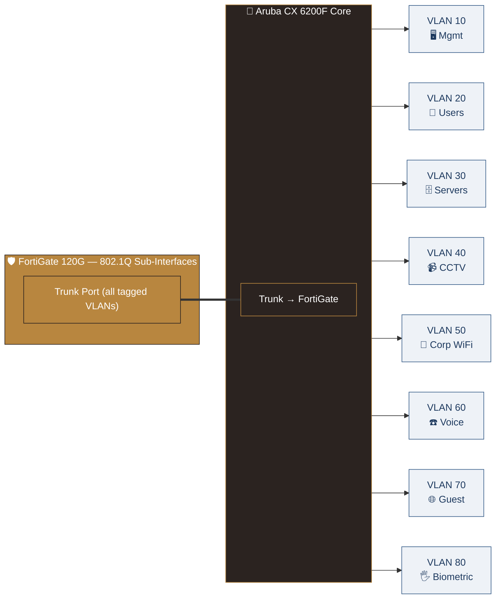
```mermaid
flowchart LR
    subgraph FG["🛡️ FortiGate 120G — 802.1Q Sub-Interfaces"]
        direction TB
        T["Trunk Port (all tagged VLANs)"]
    end
    subgraph CORE["🔀 Aruba CX 6200F Core"]
        direction TB
        TR["Trunk → FortiGate"]
    end
    T === TR
    CORE --> A10["VLAN 10<br/>🖥️ Mgmt"]
    CORE --> A20["VLAN 20<br/>👥 Users"]
    CORE --> A30["VLAN 30<br/>🗄️ Servers"]
    CORE --> A40["VLAN 40<br/>📹 CCTV"]
    CORE --> A50["VLAN 50<br/>📶 Corp WiFi"]
    CORE --> A60["VLAN 60<br/>☎️ Voice"]
    CORE --> A70["VLAN 70<br/>🌐 Guest"]
    CORE --> A80["VLAN 80<br/>🖐️ Biometric"]

    classDef fw fill:#b8863f,stroke:#2b2320,color:#fff;
    classDef core fill:#2b2320,stroke:#b8863f,color:#fff;
    classDef v fill:#eef2f7,stroke:#3a5f8a,color:#1e3a5f;
    class FG,T fw;
    class CORE,TR core;
    class A10,A20,A30,A40,A50,A60,A70,A80 v;
```

### 13.3 Port Assignment Strategy

🟡 `[ASSUMPTION — VALIDATE: representative access-switch port profile]`

| Port Range | VLAN (Untagged/Access) | Voice VLAN (Tagged) | Use |
|------------|------------------------|---------------------|-----|
| 1–12 | 20 (Users) | 60 (Voice) | Desk ports (PC + IP phone) |
| 13–16 | 40 (CCTV) | — | IP cameras (PoE) |
| 17–18 | 80 (Biometric) | — | Access control |
| 19–22 | 10 (via AP native) | 50/70 (tagged) | FortiAP uplinks |
| 23–24 | Trunk | All | Uplink to core |

### 13.4 VLAN Design Rationale

- **Segmentation** limits broadcast domains and contains security incidents.
- **IoT isolation** (CCTV, Biometric) prevents lateral movement from compromised devices.
- **Guest isolation** protects corporate data from untrusted visitors.
- **Voice separation** enables QoS prioritization for call quality.
- **Management VLAN** restricts administrative access to infrastructure.

<div style="page-break-after: always;"></div>

---

## 14. Firewall Design

### 14.1 Overview

The **FortiGate 120G** is the security nucleus of the Mathera Tech network. It performs perimeter defense, inter-VLAN routing, NAT, DHCP, and unified threat management (UTM). It operates in **NAT/Route mode** as a standalone appliance.

### 14.2 FortiGate Architecture

> **Diagram 4 — FortiGate Architecture**

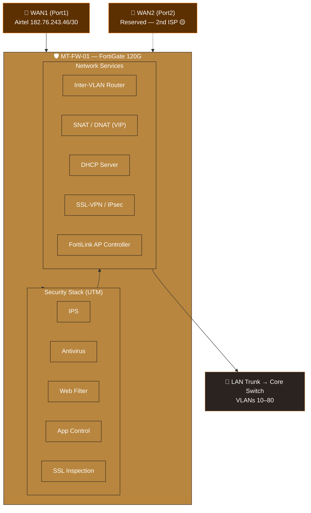
```mermaid
flowchart TB
    WAN1["🔗 WAN1 (Port1)<br/>Airtel 182.76.243.46/30"]
    WAN2["🔗 WAN2 (Port2)<br/>Reserved — 2nd ISP 🟡"]
    subgraph FG["🛡️ MT-FW-01 — FortiGate 120G"]
        direction TB
        subgraph SEC["Security Stack (UTM)"]
            IPS["IPS"]
            AV["Antivirus"]
            WF["Web Filter"]
            AC["App Control"]
            SSL["SSL Inspection"]
        end
        subgraph SVC["Network Services"]
            RT["Inter-VLAN Router"]
            NAT["SNAT / DNAT (VIP)"]
            DHCP["DHCP Server"]
            VPN["SSL-VPN / IPsec"]
            FL["FortiLink AP Controller"]
        end
    end
    LAN["🔀 LAN Trunk → Core Switch<br/>VLANs 10–80"]

    WAN1 --> FG
    WAN2 -.-> FG
    FG --> SEC --> SVC --> LAN

    classDef wan fill:#5c3000,stroke:#e57000,color:#fff;
    classDef fw fill:#b8863f,stroke:#2b2320,color:#fff;
    classDef lan fill:#2b2320,stroke:#b8863f,color:#fff;
    class WAN1,WAN2 wan;
    class FG,SEC,SVC,IPS,AV,WF,AC,SSL,RT,NAT,DHCP,VPN,FL fw;
    class LAN lan;
```

### 14.3 Firewall Policy Matrix

The firewall enforces a **default-deny** posture. The matrix below summarizes permitted inter-zone flows 🟡 `[ASSUMPTION — VALIDATE: tune to actual requirements]`.

| From ↓ / To → | Mgmt(10) | Users(20) | Servers(30) | CCTV(40) | CorpWiFi(50) | Voice(60) | Guest(70) | Biometric(80) | Internet |
|---------------|:--------:|:---------:|:-----------:|:--------:|:------------:|:---------:|:---------:|:-------------:|:--------:|
| **Mgmt (10)** | — | ✅ | ✅ | ✅ | ✅ | ✅ | ❌ | ✅ | ✅ |
| **Users (20)** | ❌ | — | ⚠️ apps | ❌ | ❌ | ❌ | ❌ | ❌ | ✅ |
| **Servers (30)** | ❌ | ⚠️ | — | ❌ | ⚠️ | ❌ | ❌ | ❌ | ⚠️ |
| **CCTV (40)** | ❌ | ❌ | ⚠️ NVR | — | ❌ | ❌ | ❌ | ❌ | ❌ |
| **CorpWiFi (50)** | ❌ | ❌ | ⚠️ apps | ❌ | — | ❌ | ❌ | ❌ | ✅ |
| **Voice (60)** | ❌ | ❌ | ⚠️ PBX | ❌ | ❌ | — | ❌ | ❌ | ✅ |
| **Guest (70)** | ❌ | ❌ | ❌ | ❌ | ❌ | ❌ | — | ❌ | ✅ |
| **Biometric (80)** | ❌ | ❌ | ⚠️ server | ❌ | ❌ | ❌ | ❌ | — | ❌ |

**Legend:** ✅ Allow · ⚠️ Allow specific ports/services only · ❌ Deny

### 14.4 Firewall Policy Flow

> **Diagram 17 — Firewall Policy Flow**

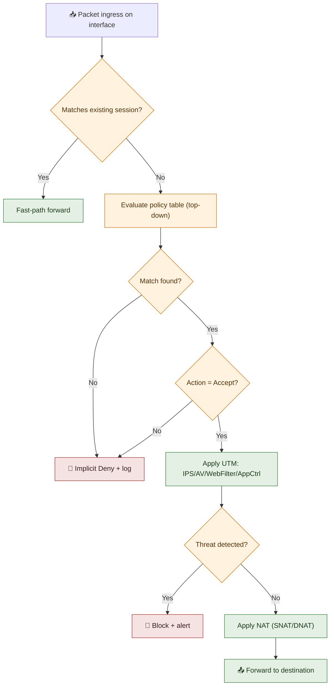
```mermaid
flowchart TD
    A["📥 Packet ingress on interface"] --> B{"Matches existing session?"}
    B -->|"Yes"| C["Fast-path forward"]
    B -->|"No"| D["Evaluate policy table (top-down)"]
    D --> E{"Match found?"}
    E -->|"No"| F["🚫 Implicit Deny + log"]
    E -->|"Yes"| G{"Action = Accept?"}
    G -->|"No"| F
    G -->|"Yes"| H["Apply UTM: IPS/AV/WebFilter/AppCtrl"]
    H --> I{"Threat detected?"}
    I -->|"Yes"| J["🚫 Block + alert"]
    I -->|"No"| K["Apply NAT (SNAT/DNAT)"]
    K --> L["📤 Forward to destination"]

    classDef ok fill:#e3f0e3,stroke:#2e7d32,color:#1b3a1b;
    classDef bad fill:#f5e3e3,stroke:#c62828,color:#3a1b1b;
    classDef dec fill:#fff3e0,stroke:#e57000,color:#5c3000;
    class C,H,K,L ok;
    class F,J bad;
    class B,E,G,I,D dec;
```

### 14.5 NAT & Virtual IP (VIP) / Port Forwarding

🟡 `[ASSUMPTION — VALIDATE: public service mapping]`

| Service | External | Internal (VIP/DNAT) | Ports |
|---------|----------|---------------------|-------|
| Mail (Carbonio) | 182.76.243.46 | 192.168.10.4 | 25, 465, 587, 993, 995, 443 |
| Webmail HTTPS | 182.76.243.46 | 192.168.10.4 | 443 |
| SSL-VPN | 182.76.243.46 | FortiGate | 443/10443 🟡 |
| **Outbound (all LAN)** | → 182.76.243.46 | SNAT (overload) | any |

> ⚠️ **Security Note:** Only expose the minimum required services. Place published web apps behind FortiGate **SSL inspection** and consider a reverse proxy / WAF. Restrict SSL-VPN with MFA (FortiToken) — see §24.

### 14.6 UTM Security Services

| Service | Status | Profile |
|---------|:------:|---------|
| Intrusion Prevention (IPS) | ✅ Enabled 🟡 | FortiGuard signatures |
| Antivirus | ✅ Enabled 🟡 | Flow/proxy-based |
| Web Filtering | ✅ Enabled 🟡 | Category-based |
| Application Control | ✅ Enabled 🟡 | Block P2P/risky apps |
| SSL/SSH Inspection | ⚠️ Selective 🟡 | Deep inspection where feasible |
| DNS Filter | ✅ Enabled 🟡 | Block malicious domains |

<div style="page-break-after: always;"></div>

---

## 15. Routing Design

### 15.1 Overview

Routing is intentionally simple and centralized. The FortiGate is the sole Layer 3 device for internal routing (router-on-a-stick), and a single default route directs all internet-bound traffic to the Airtel ISP.

### 15.2 Routing Table

| Destination | Next Hop / Interface | Type | Notes |
|-------------|----------------------|------|-------|
| 0.0.0.0/0 | 182.76.243.45 (Airtel GW) | Static default | Primary WAN |
| 0.0.0.0/0 | 2nd ISP GW 🟡 | Static (backup, higher distance) | Failover — pending |
| 192.168.10.0/24 | VLAN 10 interface | Connected | Management |
| 192.168.20.0/24 | VLAN 20 interface | Connected | Users |
| 192.168.30.0/24 | VLAN 30 interface | Connected | Servers |
| 192.168.40.0/24 | VLAN 40 interface | Connected | CCTV |
| 192.168.50.0/24 | VLAN 50 interface | Connected | Corp WiFi |
| 192.168.60.0/24 | VLAN 60 interface | Connected | Voice |
| 192.168.70.0/24 | VLAN 70 interface | Connected | Guest |
| 192.168.80.0/24 | VLAN 80 interface | Connected | Biometric |

### 15.3 Internet to User Traffic Flow

> **Diagram 16 — Internet ↔ User Traffic Flow**

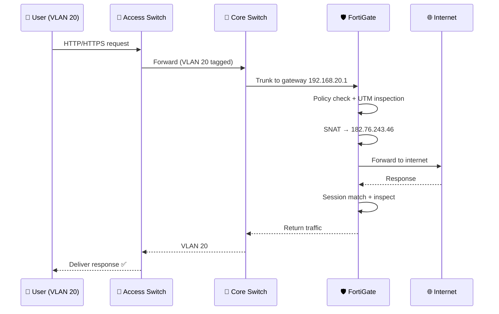
```mermaid
sequenceDiagram
    participant U as 👤 User (VLAN 20)
    participant SW as 🔌 Access Switch
    participant C as 🔀 Core Switch
    participant FW as 🛡️ FortiGate
    participant I as 🌐 Internet
    U->>SW: HTTP/HTTPS request
    SW->>C: Forward (VLAN 20 tagged)
    C->>FW: Trunk to gateway 192.168.20.1
    FW->>FW: Policy check + UTM inspection
    FW->>FW: SNAT → 182.76.243.46
    FW->>I: Forward to internet
    I-->>FW: Response
    FW->>FW: Session match + inspect
    FW-->>C: Return traffic
    C-->>SW: VLAN 20
    SW-->>U: Deliver response ✅
```

### 15.4 Routing Design Notes

- **Default route** via Airtel; when a second ISP is added, configure **SD-WAN** with health checks for automatic failover and (optionally) load balancing.
- **No dynamic routing** (OSPF/BGP) required at this scale — static routing is optimal for simplicity and predictability.
- **Policy routes** may be added (e.g., pin mail server outbound to a specific WAN for consistent reverse-DNS/PTR).

<div style="page-break-after: always;"></div>

---

## 16. Wireless Design

### 16.1 Overview

Wireless connectivity is provided by **three FortiAP 231K-D** Wi-Fi 6E access points, centrally managed by the FortiGate via **FortiLink (CAPWAP)**. This unifies wired and wireless policy under a single console and applies the same UTM protection to wireless traffic.

### 16.2 Wireless Architecture

> **Diagram 14 — Wireless Architecture**

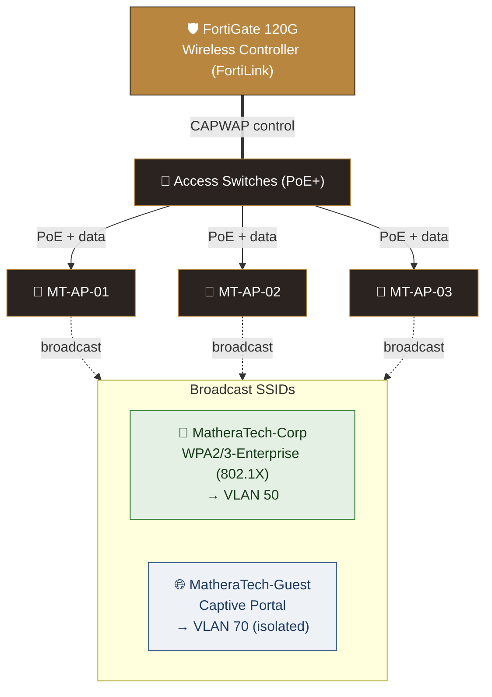
```mermaid
flowchart TB
    FW["🛡️ FortiGate 120G<br/>Wireless Controller (FortiLink)"]
    SW["🔌 Access Switches (PoE+)"]
    AP1["📶 MT-AP-01"]
    AP2["📶 MT-AP-02"]
    AP3["📶 MT-AP-03"]
    subgraph SSIDS["Broadcast SSIDs"]
        CORP["🔐 MatheraTech-Corp<br/>WPA2/3-Enterprise (802.1X)<br/>→ VLAN 50"]
        GUEST["🌐 MatheraTech-Guest<br/>Captive Portal<br/>→ VLAN 70 (isolated)"]
    end
    FW ===|"CAPWAP control"| SW
    SW -->|"PoE + data"| AP1 & AP2 & AP3
    AP1 & AP2 & AP3 -.broadcast.-> SSIDS

    classDef fw fill:#b8863f,stroke:#2b2320,color:#fff;
    classDef ap fill:#2b2320,stroke:#b8863f,color:#fff;
    classDef corp fill:#e3f0e3,stroke:#2e7d32,color:#1b3a1b;
    classDef guest fill:#eef2f7,stroke:#3a5f8a,color:#1e3a5f;
    class FW fw;
    class SW,AP1,AP2,AP3 ap;
    class CORP corp;
    class GUEST guest;
```

### 16.3 SSID Configuration

| SSID | VLAN | Security | Auth | Isolation | Purpose |
|------|:----:|----------|------|:---------:|---------|
| **MatheraTech-Corp** | 50 | WPA2/3-Enterprise | 802.1X → AD/RADIUS 🟡 | No | Staff devices |
| **MatheraTech-Guest** | 70 | Captive Portal | Portal + T&C | Yes (client isolation) | Visitors |

> 🟡 `[ASSUMPTION — VALIDATE]` 802.1X for Corporate SSID requires a RADIUS/NPS server integrated with AD. If not deployed, an interim **WPA2-PSK** with a strong passphrase and periodic rotation can be used; NPS on a DC is recommended.

### 16.4 RF & Coverage Design

| Parameter | Design |
|-----------|--------|
| **Standard** | Wi-Fi 6E (802.11ax) tri-band |
| **AP Count** | 3 (for 25–50 users, 1–2 floors) |
| **Placement** | Ceiling-mount, staggered per floor 🟡 |
| **Channel Plan** | Auto (FortiGate DARRP) 🟡 |
| **Band Steering** | Enabled (prefer 5/6 GHz) |
| **Roaming** | 802.11k/v/r fast roaming 🟡 |

### 16.5 Wireless Security Controls

- WPA3 where client-compatible; WPA2-Enterprise minimum for Corporate.
- Guest traffic **isolated** from all internal VLANs — internet-only egress.
- Rogue AP detection via FortiGate WIDS 🟡.
- All wireless traffic subject to FortiGate UTM inspection.

<div style="page-break-after: always;"></div>

---

## 17. Server Design

### 17.1 Overview

The compute foundation is a single **HPE ProLiant DL380 Gen11** (MT-SV-01) — a 2U enterprise rack server chosen for its reliability, expandability, and integrated **iLO 6** out-of-band management. It hosts the Proxmox VE hypervisor and, through it, the primary domain controller and application workloads.

### 17.2 Server Specification

| Component | Specification | Status |
|-----------|---------------|:------:|
| **Model** | HPE ProLiant DL380 Gen11 (2U) | ✅ |
| **Processor** | 2× Intel Xeon Scalable 4th Gen | 🟡 |
| **Memory** | 128 GB DDR5 ECC RDIMM | 🟡 |
| **Storage Controller** | HPE MR/Smart Array (RAID) | 🟡 |
| **Disks** | SSD/SAS in RAID-10 | 🟡 |
| **Network** | 4× 1GbE + OCP 10GbE option | 🟡 |
| **Power** | 2× Redundant Hot-Plug PSU | 🟡 |
| **Management** | HPE iLO 6 — 192.168.20.51 | ✅ IP confirmed |
| **Form Factor** | 2U rack (U18–19) | 🟡 |

### 17.3 iLO Out-of-Band Management

The HPE Integrated Lights-Out (iLO 6) provides remote power control, virtual console/media, and hardware health monitoring independent of the host OS.

| Setting | Value | Recommendation |
|---------|-------|----------------|
| iLO IP | 192.168.20.51 (VLAN 20) | 🟡 **Relocate to VLAN 10 (Management)** — iLO on the user VLAN is a security concern |
| License | iLO Advanced 🟡 | Enables remote console/media |
| Access | HTTPS + dedicated admin creds | Restrict to mgmt hosts only |

> ⚠️ **Recommendation:** Move iLO to the **Management VLAN (10)** and restrict access via firewall policy to authorized administrator hosts only. Out-of-band interfaces on user networks are a common attack vector.

### 17.4 Server Resilience Features

| Feature | Present | Notes |
|---------|:-------:|-------|
| Redundant PSU | 🟡 | Confirm dual PSU on separate power feeds |
| RAID (disk redundancy) | 🟡 | RAID-10 recommended |
| Hot-swap drives | ✅ | DL380 standard |
| ECC Memory | ✅ | Error correction |
| iLO health alerts | ✅ | Configure SMTP alerting 🟡 |

<div style="page-break-after: always;"></div>

---

## 18. Hypervisor Design

### 18.1 Overview

**MT-PVE-01** runs **Proxmox VE** on MT-SV-01, providing the KVM-based virtualization layer. Management is via the Proxmox web UI over HTTPS, resolved by `ve.matheratech.in`.

| Attribute | Value |
|-----------|-------|
| **Hostname** | MT-PVE-01 |
| **Management IP** | 192.168.30.10 (VLAN 30) |
| **Management URL** | https://ve.matheratech.in:8006 |
| **DNS Name** | ve.matheratech.in |
| **Version** | Proxmox VE 8.x 🟡 |
| **Cluster** | Standalone (single node) |

### 18.2 Hypervisor Networking

Proxmox uses a **VLAN-aware Linux bridge** (`vmbr0`) bound to the server's physical NIC(s), trunked (802.1Q) to the core switch. Each VM's virtual NIC is tagged into its correct VLAN.

| Bridge | Uplink | Mode | VLANs |
|--------|--------|------|-------|
| vmbr0 | NIC1 (+NIC2 LACP) 🟡 | VLAN-aware trunk | 10, 20, 30, 40, 50, 60, 70, 80 |

### 18.3 Hypervisor Management & Hardening

| Control | Recommendation |
|---------|----------------|
| Web UI access | Restrict to VLAN 10/30 admin hosts via firewall 🟡 |
| Authentication | Strong root password + PAM/AD realm 🟡; enable 2FA (TOTP) |
| Updates | Apply Proxmox + kernel updates in maintenance windows |
| Firewall | Enable Proxmox datacenter firewall 🟡 |
| Backups | Integrate Proxmox Backup Server — §26 🔴 |

### 18.4 Cluster / HA Consideration

> 💡 **Future:** Adding a **second Proxmox node** would enable clustering, live migration, and high availability — eliminating the current single-host risk (§28). At minimum, deploy **Proxmox Backup Server** now so VMs can be rapidly restored to replacement hardware.

<div style="page-break-after: always;"></div>

---

## 19. Application Architecture

### 19.1 Application Landscape

Mathera Tech runs three primary business applications, all virtualized on MT-PVE-01 and published securely via the FortiGate.

| Application | Hostname | IP | VLAN | URL | Function |
|-------------|----------|----|----|-----|----------|
| Carbonio Mail | MT-MAIL-01 | 192.168.10.4 | 10 | https://mail.matheratech.in | Email & collaboration |
| GLPI | MT-ASSET-01 | 192.168.30.3 | 30 | https://assets.matheratech.in | Asset management |
| Helpdesk | MT-HD-01 | 192.168.10.3 | 10 | https://helpdesk.matheratech.in | Ticketing / ITSM |

> 🟡 **Design Note:** Mail and Helpdesk currently reside on the **Management VLAN (10)**, while GLPI and the DCs reside on the **Server VLAN (30)**. For a cleaner security model, consider relocating application servers to VLAN 30 and reserving VLAN 10 strictly for infrastructure management. Documented here as-configured with a recommendation to standardize.

### 19.2 Application Architecture Diagram

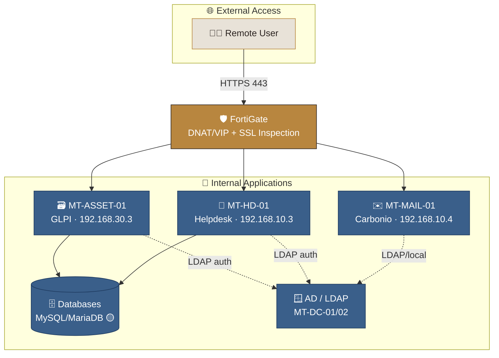
```mermaid
flowchart TB
    subgraph EXT["🌐 External Access"]
        USER["🧑‍💻 Remote User"]
    end
    FW["🛡️ FortiGate<br/>DNAT/VIP + SSL Inspection"]
    subgraph INT["🏢 Internal Applications"]
        MAIL["✉️ MT-MAIL-01<br/>Carbonio · 192.168.10.4"]
        GLPI["🗃️ MT-ASSET-01<br/>GLPI · 192.168.30.3"]
        HD["🎫 MT-HD-01<br/>Helpdesk · 192.168.10.3"]
        DB[("🗄️ Databases<br/>MySQL/MariaDB 🟡")]
        AD["🪟 AD / LDAP<br/>MT-DC-01/02"]
    end
    USER -->|HTTPS 443| FW
    FW --> MAIL & GLPI & HD
    GLPI --> DB
    HD --> DB
    GLPI -.LDAP auth.-> AD
    HD -.LDAP auth.-> AD
    MAIL -.LDAP/local.-> AD

    classDef fw fill:#b8863f,stroke:#2b2320,color:#fff;
    classDef app fill:#3a5f8a,stroke:#1e3a5f,color:#fff;
    classDef ext fill:#e8e2d8,stroke:#b8863f,color:#2b2320;
    class FW fw;
    class MAIL,GLPI,HD,DB,AD app;
    class USER ext;
```

### 19.3 Application Integration

🟡 `[ASSUMPTION — VALIDATE: integration status]`

| Integration | Description | Status |
|-------------|-------------|:------:|
| GLPI ↔ AD (LDAP) | AD-based user authentication for GLPI | Recommended 🟡 |
| Helpdesk ↔ AD (LDAP) | Single sign-on for support portal | Recommended 🟡 |
| GLPI ↔ Helpdesk | Asset-to-ticket linkage | Recommended 🟡 |
| Carbonio ↔ AD | User provisioning / auth | 🟡 |
| Apps ↔ Backup | Application-consistent backup | 🔴 Pending §26 |

### 19.4 Application Data Stores

| App | Database | Backend | Backup Priority |
|-----|----------|---------|:---------------:|
| GLPI | MariaDB/MySQL 🟡 | Local to VM | 🔴 High |
| Helpdesk | MySQL/PostgreSQL 🟡 | Local to VM | 🔴 High |
| Carbonio | Internal (PostgreSQL/OpenLDAP) | Local to VM | 🔴 Critical |

<div style="page-break-after: always;"></div>

---

## 20. Naming Convention

### 20.1 Device Naming Standard

Mathera Tech uses a structured, self-documenting naming convention:

```
MT - <ROLE> - <##>
│    │        │
│    │        └── Sequential instance number (01, 02, …)
│    └────────── Role/function code
└─────────────── Organization prefix (Mathera Tech)
```

### 20.2 Role Codes

| Code | Meaning | Example |
|------|---------|---------|
| **FW** | Firewall | MT-FW-01 |
| **SW** | Switch | MT-SW-01 |
| **AP** | Wireless Access Point | MT-AP-01 |
| **SV** | Physical Server | MT-SV-01 |
| **PVE** | Proxmox Hypervisor | MT-PVE-01 |
| **DC** | Domain Controller | MT-DC-01 |
| **MAIL** | Mail Server | MT-MAIL-01 |
| **ASSET** | Asset Mgmt (GLPI) | MT-ASSET-01 |
| **HD** | Helpdesk | MT-HD-01 |

### 20.3 Naming Consistency Check

| Hostname | Role Code | Compliant |
|----------|-----------|:---------:|
| MT-FW-01 | FW | ✅ |
| MT-SW-01 → 05 | SW | ✅ |
| MT-AP-01 → 03 | AP | ✅ |
| MT-SV-01 | SV | ✅ |
| MT-PVE-01 | PVE | ✅ |
| MT-DC-01 / 02 | DC | ✅ |
| MT-MAIL-01 | MAIL | ✅ |
| MT-ASSET-01 | ASSET | ✅ |
| MT-HD-01 | HD | ✅ |

> ✅ **All devices conform to the naming standard.** Extend the same convention to future assets (e.g., MT-NAS-01 for storage, MT-PBS-01 for backup server, MT-MON-01 for monitoring).

<div style="page-break-after: always;"></div>

---

## 21. IP Address Plan

### 21.1 Subnet Allocation

| VLAN | Subnet | Mask | Gateway | Usable Range | Broadcast |
|:----:|--------|------|---------|--------------|-----------|
| 10 | 192.168.10.0 | /24 | .1 | .1 – .254 | .255 |
| 20 | 192.168.20.0 | /24 | .1 | .1 – .254 | .255 |
| 30 | 192.168.30.0 | /24 | .1 | .1 – .254 | .255 |
| 40 | 192.168.40.0 | /24 | .1 | .1 – .254 | .255 |
| 50 | 192.168.50.0 | /24 | .1 | .1 – .254 | .255 |
| 60 | 192.168.60.0 | /24 | .1 | .1 – .254 | .255 |
| 70 | 192.168.70.0 | /24 | .1 | .1 – .254 | .255 |
| 80 | 192.168.80.0 | /24 | .1 | .1 – .254 | .255 |

### 21.2 IP Address Architecture

> **Diagram 6 — IP Address Architecture**

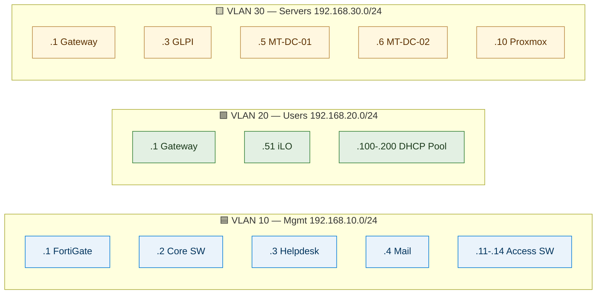
```mermaid
flowchart LR
    subgraph MGMT["🟦 VLAN 10 — Mgmt 192.168.10.0/24"]
        M1[".1 FortiGate"]
        M2[".2 Core SW"]
        M3[".3 Helpdesk"]
        M4[".4 Mail"]
        M5[".11-.14 Access SW"]
    end
    subgraph USERS["🟩 VLAN 20 — Users 192.168.20.0/24"]
        U1[".1 Gateway"]
        U2[".51 iLO"]
        U3[".100-.200 DHCP Pool"]
    end
    subgraph SRV["🟨 VLAN 30 — Servers 192.168.30.0/24"]
        S1[".1 Gateway"]
        S2[".3 GLPI"]
        S3[".5 MT-DC-01"]
        S4[".6 MT-DC-02"]
        S5[".10 Proxmox"]
    end
    classDef m fill:#eaf3fb,stroke:#0078d4,color:#00335c;
    classDef u fill:#e3f0e3,stroke:#2e7d32,color:#1b3a1b;
    classDef s fill:#fff7e0,stroke:#b8863f,color:#5c3000;
    class M1,M2,M3,M4,M5 m;
    class U1,U2,U3 u;
    class S1,S2,S3,S4,S5 s;
```

### 21.3 Static IP Assignments (Detailed)

**VLAN 10 — Management (192.168.10.0/24)**

| IP | Host | Role |
|----|------|------|
| .1 | MT-FW-01 | FortiGate (gateway) |
| .2 | MT-SW-01 | Core switch |
| .3 | MT-HD-01 | Helpdesk |
| .4 | MT-MAIL-01 | Carbonio Mail |
| .11 | MT-SW-02 | Access switch |
| .12 | MT-SW-03 | Access switch |
| .13 | MT-SW-04 | Access switch |
| .14 | MT-SW-05 | Access switch |

**VLAN 20 — Users (192.168.20.0/24)**

| IP | Host | Role |
|----|------|------|
| .1 | Gateway (FortiGate) | Gateway |
| .51 | MT-SV-01 iLO | OOB mgmt 🟡 relocate to V10 |
| .100–.200 | DHCP Pool 🟡 | User workstations |

**VLAN 30 — Servers (192.168.30.0/24)**

| IP | Host | Role |
|----|------|------|
| .1 | Gateway (FortiGate) | Gateway |
| .3 | MT-ASSET-01 | GLPI |
| .5 | MT-DC-01 | Primary DC/DNS |
| .6 | MT-DC-02 | Secondary DC/DNS |
| .10 | MT-PVE-01 | Proxmox host |

### 21.4 DHCP Scopes (FortiGate)

🟡 `[ASSUMPTION — VALIDATE: pool ranges]`

| VLAN | Scope Range | DNS Servers | Lease |
|:----:|-------------|-------------|-------|
| 20 Users | .100 – .200 | 192.168.30.5, .6 | 8 days |
| 40 CCTV | .50 – .200 | — | 7 days |
| 50 Corp WiFi | .50 – .230 | 192.168.30.5, .6 | 1 day |
| 60 Voice | .50 – .200 | 🟡 | 7 days |
| 70 Guest | .50 – .230 | 1.1.1.1, 8.8.8.8 | 4 hours |
| 80 Biometric | .50 – .200 | — | 7 days |

### 21.5 Public IP Allocation

| Public IP | Subnet | Assignment |
|-----------|--------|------------|
| 182.76.243.46 | /30 (255.255.255.252) | FortiGate WAN1 (Airtel) |
| 182.76.243.45 | — | ISP Gateway |

<div style="page-break-after: always;"></div>

---

## 22. DNS Records

### 22.1 Internal DNS Records (AD-Integrated — matheratech.in)

| Record | Type | Value | Purpose |
|--------|------|-------|---------|
| ve | A | 192.168.30.10 | Proxmox management |
| assets | A | 192.168.30.3 | GLPI |
| helpdesk | A | 192.168.10.3 | Helpdesk |
| mail | A | 192.168.10.4 | Carbonio (internal) |
| MT-DC-01 | A | 192.168.30.5 | Primary DC |
| MT-DC-02 | A | 192.168.30.6 | Secondary DC |
| _ldap._tcp | SRV | DC-01, DC-02 | AD service location |
| _kerberos._tcp | SRV | DC-01, DC-02 | Kerberos KDC |

### 22.2 Public DNS Records (matheratech.in) 🟡 `[ASSUMPTION — VALIDATE]`

| Record | Type | Value | Purpose |
|--------|------|-------|---------|
| @ | A | 182.76.243.46 | Root domain 🟡 |
| mail | A | 182.76.243.46 | Public webmail / SMTP |
| autodiscover | CNAME | mail.matheratech.in | Client autoconfig |
| @ | MX | 10 mail.matheratech.in | Mail routing |
| @ | TXT (SPF) | `v=spf1 a mx ip4:182.76.243.46 -all` | Anti-spoofing |
| default._domainkey | TXT (DKIM) | (Carbonio DKIM key) 🟡 | Email signing |
| _dmarc | TXT (DMARC) | `v=DMARC1; p=quarantine; rua=mailto:postmaster@matheratech.in` 🟡 | Email policy |

### 22.3 Reverse DNS / PTR

> ⚠️ **Mail Deliverability:** Request a **PTR record** from Airtel for 182.76.243.46 → `mail.matheratech.in`. Missing reverse DNS is a leading cause of outbound mail being marked as spam. Also ensure SPF, DKIM, and DMARC are correctly published (§32).

<div style="page-break-after: always;"></div>

---

## 23. SSL Certificates

### 23.1 Certificate Inventory 🟡 `[ASSUMPTION — VALIDATE all cert details]`

| Service | Common Name | Type | Issuer | Renewal |
|---------|-------------|------|--------|---------|
| Webmail | mail.matheratech.in | DV/SAN | Let's Encrypt 🟡 | Auto (ACME) 🟡 |
| GLPI | assets.matheratech.in | DV | Let's Encrypt 🟡 | Auto (ACME) 🟡 |
| Helpdesk | helpdesk.matheratech.in | DV | Let's Encrypt 🟡 | Auto (ACME) 🟡 |
| Proxmox | ve.matheratech.in | DV/Internal | Let's Encrypt / Self-signed 🟡 | Auto/Manual 🟡 |
| SSL-VPN | 182.76.243.46 | DV | Let's Encrypt 🟡 | Auto 🟡 |

### 23.2 Recommended Certificate Strategy

> 💡 **Recommendation:** Deploy a **wildcard certificate** `*.matheratech.in` (or SAN cert covering all service names) via an ACME client with DNS-01 validation for automated renewal. This simplifies management and prevents expiry-related outages.

| Aspect | Recommendation |
|--------|----------------|
| Certificate Authority | Let's Encrypt (free, automated) or DigiCert (commercial EV) 🟡 |
| Type | Wildcard `*.matheratech.in` |
| Key | RSA 2048 / ECDSA P-256 |
| Renewal | Automated (ACME); alert 30 days before expiry |
| Tracking | Record expiry dates in GLPI (§30) |
| Cipher Policy | TLS 1.2+ only; disable weak ciphers |

### 23.3 Certificate Lifecycle

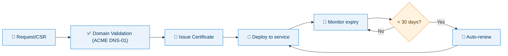
```mermaid
flowchart LR
    A["📝 Request/CSR"] --> B["✅ Domain Validation (ACME DNS-01)"]
    B --> C["📜 Issue Certificate"]
    C --> D["🚀 Deploy to service"]
    D --> E["📅 Monitor expiry"]
    E --> F{"< 30 days?"}
    F -->|"Yes"| G["🔄 Auto-renew"]
    G --> D
    F -->|"No"| E
    classDef s fill:#eaf3fb,stroke:#0078d4,color:#00335c;
    classDef d fill:#fff3e0,stroke:#e57000,color:#5c3000;
    class A,B,C,D,E,G s;
    class F d;
```

<div style="page-break-after: always;"></div>

---

## 24. Security Architecture

### 24.1 Defense-in-Depth Model

Mathera Tech's security follows a layered **defense-in-depth** approach — no single control is relied upon.

```mermaid
flowchart TB
    L1["🌐 Layer 1 — Perimeter<br/>FortiGate NGFW · IPS · AV · Web Filter · Geo-block"]
    L2["🧱 Layer 2 — Network<br/>VLAN segmentation · Default-deny · Client isolation"]
    L3["🖥️ Layer 3 — Host<br/>OS hardening · Patching · Endpoint protection 🟡"]
    L4["🪟 Layer 4 — Identity<br/>Active Directory · Least privilege · MFA (VPN) 🟡"]
    L5["📦 Layer 5 — Application<br/>HTTPS/TLS · LDAP auth · Reverse proxy 🟡"]
    L6["📊 Layer 6 — Monitoring 🔴<br/>Logging · SIEM · Alerting (to deploy)"]
    L1 --> L2 --> L3 --> L4 --> L5 --> L6
    classDef sec fill:#2b2320,stroke:#b8863f,color:#fff;
    classDef gap fill:#5c1a1a,stroke:#c62828,color:#fff;
    class L1,L2,L3,L4,L5 sec;
    class L6 gap;
```

### 24.2 Security Controls Summary

| Domain | Control | Status |
|--------|---------|:------:|
| Perimeter | FortiGate NGFW + UTM | ✅ |
| Perimeter | Geo-blocking of high-risk countries | 🟡 Recommended |
| Network | VLAN segmentation (8 zones) | ✅ |
| Network | Default-deny inter-VLAN policy | ✅ |
| Network | Guest/IoT isolation | ✅ |
| Identity | Active Directory | ✅ |
| Identity | Strong password policy (GPO) | 🟡 §25 |
| Identity | MFA for remote/VPN access | 🟡 Recommended (FortiToken) |
| Remote Access | SSL-VPN | 🟡 |
| Endpoint | EDR/AV | 🟡 `[VALIDATE]` |
| Data | Backup & encryption | 🔴 To deploy |
| Monitoring | Central logging/SIEM | 🔴 To deploy |
| Admin | Role-based admin, MFA on consoles | 🟡 Recommended |

### 24.3 Remote Access (VPN) Design

| Attribute | Design |
|-----------|--------|
| Type | FortiGate SSL-VPN (web + tunnel) 🟡 |
| Authentication | AD (LDAP) + **FortiToken MFA** 🟡 |
| Access scope | Restricted per-group firewall policy |
| Encryption | TLS 1.2+, strong ciphers |
| Split tunneling | Disabled (recommended) 🟡 |

### 24.4 Security Hardening Checklist

- ✅ Change all default credentials on every device.
- 🟡 Enable MFA on FortiGate admin, Proxmox, and VPN.
- 🟡 Restrict management access to VLAN 10 only.
- 🟡 Enable FortiGate security fabric logging to FortiAnalyzer/syslog.
- 🟡 Apply OS/firmware patches on a monthly cadence.
- 🟡 Disable unused ports; enable port security on access switches.
- 🟡 Configure NTP from a trusted source for accurate logs.
- 🟡 Implement admin session timeouts and trusted-host ACLs.

### 24.5 NTP / Time Synchronization

🟡 `[ASSUMPTION — VALIDATE]` All devices should sync to a consistent time source. Recommended: FortiGate as internal NTP master syncing to `pool.ntp.org`; DCs (PDC Emulator) as authoritative time for domain members.

<div style="page-break-after: always;"></div>

---

## 25. Group Policy (GPO) Overview

### 25.1 Recommended GPO Baseline

🟡 `[ASSUMPTION — VALIDATE: representative enterprise GPO set]`

| GPO Name | Scope | Purpose |
|----------|-------|---------|
| **MT-Password-Policy** | Domain | Enforce complexity, length ≥12, history, lockout |
| **MT-Account-Lockout** | Domain | Lockout after 5 failed attempts |
| **MT-Security-Baseline** | Computers | Microsoft security baseline settings |
| **MT-Drive-Mapping** | Users | Map shared network drives |
| **MT-Desktop-Policy** | Users | Standard desktop, screensaver lock |
| **MT-Firewall-Policy** | Computers | Windows Defender Firewall rules |
| **MT-Software-Deploy** | Computers | Deploy standard applications |
| **MT-USB-Control** | Computers | Restrict removable media 🟡 |
| **MT-Windows-Update** | Computers | WSUS/Update ring config 🟡 |
| **MT-Screen-Lock** | Users | Auto-lock after 10 min idle |

### 25.2 Password Policy (Recommended)

| Setting | Value |
|---------|-------|
| Minimum length | 12 characters |
| Complexity | Enabled |
| Max age | 90 days 🟡 |
| Min age | 1 day |
| History | 24 passwords |
| Lockout threshold | 5 attempts |
| Lockout duration | 15 minutes |

### 25.3 GPO Application Order

```mermaid
flowchart LR
    L["🏠 Local Policy"] --> S["🌐 Site"]
    S --> D["🏢 Domain (matheratech.in)"]
    D --> O["📁 OU (MatheraTech → Users/Computers)"]
    O --> R["✅ Resultant Set of Policy (RSoP)"]
    classDef g fill:#eaf3fb,stroke:#0078d4,color:#00335c;
    class L,S,D,O,R g;
```

> 💡 Follow **LSDOU** precedence (Local → Site → Domain → OU). Use security filtering and WMI filters for targeted application. Document each GPO's linked OU and enforcement status.

<div style="page-break-after: always;"></div>

---

## 26. Backup Strategy

> 🔴 **CURRENT STATE: NO BACKUP SOLUTION IS DEPLOYED.** This is the single highest-priority risk in the environment. The following is the **recommended target-state design** to be implemented urgently.

### 26.1 Recommended Backup Architecture

```mermaid
flowchart TB
    subgraph PROD["🏢 Production — MT-PVE-01"]
        VM1["MT-DC-01"]
        VM2["MT-MAIL-01"]
        VM3["MT-ASSET-01"]
        VM4["MT-HD-01"]
    end
    PBS["💾 MT-PBS-01<br/>Proxmox Backup Server<br/>(dedup, incremental)"]
    DC2BK["🪟 MT-DC-02 (physical)<br/>Windows Server Backup"]
    OFF["☁️ Offsite / Cloud Copy<br/>(3-2-1 rule) 🟡"]
    PROD -->|"Nightly incremental"| PBS
    DC2BK -->|"System state"| PBS
    PBS -->|"Weekly sync"| OFF
    classDef prod fill:#3a5f8a,stroke:#1e3a5f,color:#fff;
    classDef bk fill:#2e7d32,stroke:#1b5e20,color:#fff;
    classDef off fill:#b8863f,stroke:#2b2320,color:#fff;
    class VM1,VM2,VM3,VM4,DC2BK prod;
    class PBS bk;
    class OFF off;
```

### 26.2 Recommended Backup Solution

| Component | Recommendation |
|-----------|----------------|
| **Primary tool** | Proxmox Backup Server (MT-PBS-01) — native VM backup, dedup, incremental |
| **Physical DC** | Windows Server Backup / Veeam Agent for MT-DC-02 |
| **Target** | Dedicated NAS/backup server (separate from MT-SV-01) 🟡 |
| **Offsite** | Cloud object storage or offsite NAS (3-2-1) 🟡 |
| **Encryption** | At-rest AES-256 + in-transit TLS |

### 26.3 Recommended Backup Schedule (GFS)

| Data Set | Frequency | Retention (GFS) |
|----------|-----------|-----------------|
| All VMs (full image) | Daily incremental | 14 daily |
| All VMs | Weekly full | 4 weekly |
| All VMs | Monthly full | 12 monthly |
| Application DBs (GLPI/Helpdesk/Carbonio) | Daily dump | 30 days |
| AD System State (both DCs) | Daily | 14 days |
| Offsite copy | Weekly | 4 weeks |

### 26.4 3-2-1 Backup Rule

> 📌 **3-2-1 Rule:** Keep **3** copies of data, on **2** different media, with **1** copy offsite. Currently **0 copies exist** — implementation is critical.

### 26.5 Backup Verification

- Perform **monthly test restores** to validate recoverability.
- Monitor backup job success/failure with alerting.
- Document restore procedures (see §38 Runbooks).

<div style="page-break-after: always;"></div>

---

## 27. Disaster Recovery

> 🔴 **CURRENT STATE: NO FORMAL DR PLAN OR DR SITE EXISTS.** The following establishes the recommended DR framework and target objectives.

### 27.1 Recovery Objectives (Recommended)

| Metric | Target | Definition |
|--------|--------|------------|
| **RPO** | ≤ 24 hours 🟡 | Maximum acceptable data loss |
| **RTO** | ≤ 8 hours 🟡 | Maximum acceptable downtime |
| **MTD** | ≤ 24 hours 🟡 | Maximum tolerable downtime |

### 27.2 DR Strategy Tiers

| Tier | Scope | Approach |
|------|-------|----------|
| **Tier 1 — Critical** | AD/DNS, Mail | Physical DC survives host loss; restore mail from PBS to spare hardware |
| **Tier 2 — Important** | GLPI, Helpdesk | Restore from backup within RTO |
| **Tier 3 — Standard** | Non-critical | Best-effort restore |

### 27.3 Disaster Scenarios & Response

| Scenario | Impact | Response |
|----------|--------|----------|
| MT-SV-01 hardware failure | All VMs + primary DC down | Auth continues on MT-DC-02; restore VMs from PBS to replacement/second node |
| Primary DC (VM) failure | Auth degraded | MT-DC-02 handles auth; rebuild/restore DC-01 |
| ISP outage | No internet/external mail | **Requires secondary ISP** (currently a gap) |
| Ransomware | Data encryption | Restore from **immutable/offsite** backups |
| Site loss (fire/flood) | Total | **Requires offsite backup + DR site** (gap) |

### 27.4 DR Diagram (Target State)

```mermaid
flowchart TB
    subgraph PRIMARY["🏢 Primary Site — Mandya"]
        SV["🖥️ MT-SV-01 (Proxmox)"]
        DC2["🪟 MT-DC-02 (Physical)"]
        PBS["💾 MT-PBS-01"]
    end
    subgraph DR["☁️ DR Target (Recommended)"]
        CLOUD["Offsite Backup / Cloud"]
        SPARE["Recovery Host 🟡"]
    end
    SV -->|backup| PBS
    PBS -->|replicate| CLOUD
    CLOUD -.restore.-> SPARE
    DC2 -.identity survives.-> SPARE
    classDef p fill:#3a5f8a,stroke:#1e3a5f,color:#fff;
    classDef d fill:#b8863f,stroke:#2b2320,color:#fff;
    class SV,DC2,PBS p;
    class CLOUD,SPARE d;
```

### 27.5 DR Testing

> 📌 Conduct a **DR tabletop exercise** semi-annually and a **live restore test** annually. Document results and update RPO/RTO accordingly.

<div style="page-break-after: always;"></div>

---

## 28. High Availability

### 28.1 Current HA Posture

| Component | HA Status | Risk |
|-----------|:---------:|------|
| Identity (AD) | ✅ Dual DC (1 virtual, 1 physical) | Low — good design |
| Firewall | ❌ Standalone | 🔴 SPOF |
| Core Switch | ❌ Single | 🟠 SPOF |
| Virtualization | ❌ Single host | 🔴 SPOF |
| ISP/WAN | ❌ Single link | 🟠 SPOF |
| Power | 🟡 UPS (assumed) | Validate |

### 28.2 HA Assessment

```mermaid
flowchart LR
    subgraph GOOD["✅ Resilient"]
        AD["Dual Domain Controllers<br/>Physical + Virtual"]
    end
    subgraph SPOF["🔴 Single Points of Failure"]
        FW["FortiGate (standalone)"]
        CORE["Core Switch (single)"]
        HOST["Proxmox Host (single)"]
        WAN["ISP (single link)"]
    end
    classDef g fill:#e3f0e3,stroke:#2e7d32,color:#1b3a1b;
    classDef b fill:#f5e3e3,stroke:#c62828,color:#3a1b1b;
    class AD g;
    class FW,CORE,HOST,WAN b;
```

### 28.3 HA Recommendations (Prioritized)

| Priority | Recommendation | Benefit |
|:--------:|----------------|---------|
| 🔴 P1 | Deploy Proxmox Backup Server + rapid-restore process | Recover VMs quickly on host failure |
| 🟠 P2 | Add secondary ISP + FortiGate SD-WAN | Eliminate WAN SPOF |
| 🟠 P2 | Add second Proxmox node → HA cluster | Live migration, auto-failover |
| 🟡 P3 | FortiGate HA pair (active-passive) | Firewall redundancy |
| 🟡 P3 | Dual-PSU on separate feeds + UPS | Power resilience |
| 🟡 P3 | Redundant core uplinks (LACP/MLAG) | Switch path redundancy |

### 28.4 Identity HA — What's Working Well

> ✅ **Strength:** Keeping **MT-DC-02 physical** while **MT-DC-01 is virtual** is an excellent design choice. Authentication, DNS, and Kerberos survive a total failure of the virtualization host — a common oversight this design correctly avoids.

<div style="page-break-after: always;"></div>

---

## 29. Monitoring

> 🔴 **CURRENT STATE: NO CENTRALIZED MONITORING IS DEPLOYED.** The following is the recommended target-state design.

### 29.1 Recommended Monitoring Stack

| Layer | Tool (Recommended) | Monitors |
|-------|--------------------|----------|
| Network/Infra | Zabbix or PRTG 🟡 | Devices, interfaces, up/down, thresholds |
| Firewall | FortiAnalyzer / FortiCloud 🟡 | Logs, threats, traffic |
| Server/VM | Proxmox metrics + Zabbix agent | CPU, RAM, disk, VM health |
| AD/DNS | Windows event monitoring | Replication, auth failures |
| Uptime/Web | Uptime Kuma 🟡 | Service/URL availability |
| Alerting | Email/Telegram/SMS 🟡 | Notifications |

### 29.2 Monitoring Architecture

```mermaid
flowchart TB
    subgraph MON["📊 MT-MON-01 — Monitoring Server 🟡"]
        ZBX["Zabbix / PRTG"]
        KUMA["Uptime Kuma"]
    end
    FW["🛡️ FortiGate (SNMP/syslog)"]
    SW["🔀 Switches (SNMP)"]
    PVE["🧱 Proxmox (agent/API)"]
    DC["🪟 DCs (WMI/agent)"]
    APPS["📦 Apps (HTTP checks)"]
    ADMIN["📱 Admin Alerts<br/>Email / Telegram"]
    FW & SW & PVE & DC & APPS -->|"SNMP / syslog / agent"| MON
    MON -->|"Threshold breach"| ADMIN
    classDef m fill:#2e7d32,stroke:#1b5e20,color:#fff;
    classDef d fill:#3a5f8a,stroke:#1e3a5f,color:#fff;
    class ZBX,KUMA,MON m;
    class FW,SW,PVE,DC,APPS d;
```

### 29.3 Key Metrics & Thresholds 🟡

| Metric | Warning | Critical |
|--------|---------|----------|
| CPU utilization | > 75% | > 90% |
| Memory utilization | > 80% | > 95% |
| Disk usage | > 75% | > 90% |
| WAN latency | > 100 ms | > 250 ms |
| Interface errors | > 100/min | > 1000/min |
| AD replication lag | > 30 min | > 1 hr |
| Backup job | Warning | Failed |
| Certificate expiry | < 30 days | < 7 days |

<div style="page-break-after: always;"></div>

---

## 30. Asset Management

### 30.1 Overview

**GLPI** (MT-ASSET-01) is the authoritative IT asset management and inventory system, accessible at `https://assets.matheratech.in`.

### 30.2 GLPI Architecture

> **Diagram 13 — GLPI Architecture**

```mermaid
flowchart TB
    subgraph GLPI["🗃️ MT-ASSET-01 — GLPI 192.168.30.3"]
        WEB["Web UI (HTTPS)"]
        APP["GLPI Application"]
        DB[("MariaDB/MySQL 🟡")]
    end
    AGENTS["🖥️ GLPI Agents<br/>(Workstations/Servers)"]
    AD["🪟 AD / LDAP Auth"]
    ADMIN["👤 IT Admin"]
    AGENTS -->|"Inventory push"| APP
    APP --> DB
    ADMIN -->|HTTPS| WEB
    WEB -.LDAP.-> AD
    classDef g fill:#3a5f8a,stroke:#1e3a5f,color:#fff;
    classDef e fill:#e8e2d8,stroke:#b8863f,color:#2b2320;
    class WEB,APP,DB g;
    class AGENTS,AD,ADMIN e;
```

### 30.3 Asset Categories Tracked

| Category | Examples |
|----------|----------|
| Network | Firewall, switches, APs |
| Compute | Servers, workstations |
| Software | Licenses, subscriptions, expiry |
| Peripherals | Printers, phones |
| Contracts | Warranty, AMC, support 🟡 |
| Certificates | SSL expiry tracking |

> 💡 **Recommendation:** Use GLPI to centrally track **warranty dates, license renewals, and SSL expiry** — directly addressing gaps flagged in §5, §6, and §23. Deploy GLPI agents for automated inventory.

<div style="page-break-after: always;"></div>

---

## 31. Helpdesk Architecture

### 31.1 Overview

The **Helpdesk** platform (MT-HD-01) provides IT service management and ticketing at `https://helpdesk.matheratech.in`. 🟡 `[VALIDATE: specific helpdesk product]`

### 31.2 Helpdesk Architecture

> **Diagram 12 — Helpdesk Architecture**

```mermaid
flowchart TB
    subgraph HD["🎫 MT-HD-01 — Helpdesk 192.168.10.3"]
        PORTAL["Self-Service Portal (HTTPS)"]
        ENGINE["Ticketing Engine"]
        DB[("Database 🟡")]
    end
    USER["👤 End User"]
    AGENT["🧑‍💻 Support Agent"]
    AD["🪟 AD / LDAP"]
    MAIL["✉️ Mail (notifications)"]
    USER -->|"Raise ticket"| PORTAL
    PORTAL --> ENGINE --> DB
    AGENT -->|"Resolve"| ENGINE
    PORTAL -.SSO.-> AD
    ENGINE -->|"Email updates"| MAIL
    classDef h fill:#3a5f8a,stroke:#1e3a5f,color:#fff;
    classDef e fill:#e8e2d8,stroke:#b8863f,color:#2b2320;
    class PORTAL,ENGINE,DB h;
    class USER,AGENT,AD,MAIL e;
```

### 31.3 Ticket Workflow

```mermaid
flowchart LR
    A["📩 New Ticket"] --> B["🏷️ Categorize & Prioritize"]
    B --> C["👤 Assign to Agent"]
    C --> D["🔧 In Progress"]
    D --> E{"Resolved?"}
    E -->|"No"| D
    E -->|"Yes"| F["✅ Resolved"]
    F --> G["📋 User Confirmation"]
    G --> H["🔒 Closed"]
    classDef s fill:#eaf3fb,stroke:#0078d4,color:#00335c;
    classDef d fill:#fff3e0,stroke:#e57000,color:#5c3000;
    class A,B,C,D,F,G,H s;
    class E d;
```

### 31.4 SLA Targets 🟡 `[ASSUMPTION — VALIDATE]`

| Priority | Response | Resolution |
|----------|----------|------------|
| 🔴 Critical | 30 min | 4 hours |
| 🟠 High | 2 hours | 8 hours |
| 🟡 Medium | 4 hours | 24 hours |
| 🟢 Low | 8 hours | 72 hours |

<div style="page-break-after: always;"></div>

---

## 32. Mail Architecture

### 32.1 Overview

Corporate email is delivered by **Carbonio** (MT-MAIL-01), a self-hosted collaboration suite, accessible at `https://mail.matheratech.in`.

### 32.2 Mail Server Flow

> **Diagram 11 — Mail Server Flow**

```mermaid
flowchart TB
    subgraph EXT["🌐 Internet"]
        SENDER["📤 External Sender"]
        RECIP["📥 External Recipient"]
    end
    FW["🛡️ FortiGate<br/>DNAT + AV/AS scan<br/>182.76.243.46"]
    subgraph MAIL["✉️ MT-MAIL-01 — Carbonio 192.168.10.4"]
        MTA["MTA (Postfix)"]
        STORE["Mailbox Store"]
        WEB["Webmail (HTTPS)"]
    end
    USER["👤 Internal User"]
    SENDER -->|"SMTP 25"| FW --> MTA
    MTA --> STORE
    USER -->|"IMAP/HTTPS"| WEB --> STORE
    MTA -->|"Outbound SMTP<br/>SNAT + PTR"| RECIP
    classDef fw fill:#b8863f,stroke:#2b2320,color:#fff;
    classDef m fill:#3a5f8a,stroke:#1e3a5f,color:#fff;
    classDef e fill:#e8e2d8,stroke:#b8863f,color:#2b2320;
    class FW fw;
    class MTA,STORE,WEB m;
    class SENDER,RECIP,USER e;
```

### 32.3 Mail Protocols & Ports

| Protocol | Port | Use |
|----------|:----:|-----|
| SMTP | 25 | Server-to-server mail |
| SMTP Submission | 587 | Authenticated client send |
| SMTPS | 465 | Secure submission |
| IMAPS | 993 | Secure mailbox access |
| POP3S | 995 | Secure retrieval |
| HTTPS | 443 | Webmail / autodiscover |

### 32.4 Email Deliverability & Security

| Record | Purpose | Status |
|--------|---------|:------:|
| **SPF** | Authorize sending IP | 🟡 Publish |
| **DKIM** | Cryptographic signing | 🟡 Enable in Carbonio |
| **DMARC** | Policy + reporting | 🟡 Publish |
| **PTR (rDNS)** | Reverse DNS for WAN IP | 🟡 Request from Airtel |
| **TLS** | Encrypted transport | ✅ Enforce |

> ⚠️ **Critical for deliverability:** Without correct **SPF, DKIM, DMARC, and PTR**, outbound mail from a self-hosted server on a residential/business ISP range is frequently flagged as spam. Coordinate PTR with Airtel and validate all records with tools like MXToolbox.

### 32.5 Mail Best Practices

- Enable Carbonio's built-in **antivirus/anti-spam** (ClamAV/Amavis).
- Enforce **TLS** for all client and server connections.
- Consider an **outbound smart host/relay** 🟡 if ISP blocks port 25 or reputation is a concern.
- Back up mail store **daily** (Tier-1 critical — §26).

<div style="page-break-after: always;"></div>

---

## 33. Capacity Planning

### 33.1 Current Utilization vs. Capacity

| Resource | Capacity | Current Use 🟡 | Headroom |
|----------|----------|----------------|----------|
| Host RAM | 128 GB | ~20 GB (VMs) | ~85% free |
| Host vCPU | 2× multi-core | 10 vCPU allocated | Ample |
| WAN Bandwidth | 100 Mbps | Variable | Monitor |
| Switch Ports | ~120 (5 switches) | 🟡 | Depends on headcount |
| PoE Budget | ~955 W total | APs + phones + cameras | Monitor |
| VLAN /24 subnets | 254 hosts each | Low (25–50 users) | Very large |
| IP Address Space | 8× /24 | Minimal | Abundant |

### 33.2 Growth Projections 🟡 `[ASSUMPTION — VALIDATE]`

| Horizon | Users | Consideration |
|---------|-------|---------------|
| Current | 25–50 | Comfortable |
| +12 months | up to 75 | Monitor PoE, WAN, add APs if needed |
| +24 months | up to 100+ | Consider 2nd Proxmox node, more switches, WAN upgrade |

### 33.3 Capacity Triggers

| Trigger | Action |
|---------|--------|
| Host RAM > 80% | Add RAM or second node |
| WAN utilization > 70% sustained | Upgrade bandwidth / add ISP |
| Switch ports > 80% used | Add access switch |
| PoE > 80% | Review AP/phone/camera power draw |
| Storage > 75% | Expand storage / archive |

<div style="page-break-after: always;"></div>

---

## 34. Future Expansion

### 34.1 Roadmap

> **Diagram 18 — Future Expansion**

```mermaid
flowchart TB
    NOW["📍 Current State<br/>Single site · Single host · Single ISP · No backup"]
    P1["🔴 Phase 1 (0-3 months)<br/>Deploy Backup (PBS) · Monitoring<br/>Secondary ISP · MFA"]
    P2["🟠 Phase 2 (3-9 months)<br/>2nd Proxmox node (HA cluster)<br/>FortiGate HA · SIEM/FortiAnalyzer"]
    P3["🟡 Phase 3 (9-18 months)<br/>Offsite DR · NAS storage<br/>Zero-trust segmentation refinement"]
    P4["🟢 Phase 4 (18+ months)<br/>Multi-site / branch expansion<br/>SD-WAN · Cloud integration"]
    NOW --> P1 --> P2 --> P3 --> P4
    classDef now fill:#5c1a1a,stroke:#c62828,color:#fff;
    classDef p1 fill:#8a4400,stroke:#e57000,color:#fff;
    classDef p2 fill:#5c3000,stroke:#b8863f,color:#fff;
    classDef p3 fill:#2b4a2b,stroke:#2e7d32,color:#fff;
    classDef p4 fill:#1b3a5f,stroke:#3a5f8a,color:#fff;
    class NOW now;
    class P1 p1;
    class P2 p2;
    class P3 p3;
    class P4 p4;
```

### 34.2 Planned/Recommended Additions

| Item | Naming | VLAN | Purpose |
|------|--------|:----:|---------|
| Backup Server | MT-PBS-01 | 30 | Proxmox Backup |
| Monitoring Server | MT-MON-01 | 30 | Zabbix/PRTG |
| NAS Storage | MT-NAS-01 | 30 | File/backup target |
| RADIUS/NPS | (on DC) | 30 | 802.1X Wi-Fi auth |
| 2nd Proxmox Node | MT-PVE-02 | 30 | HA cluster |
| Secondary ISP | — | WAN2 | SD-WAN failover |
| FortiGate HA peer | MT-FW-02 | 10 | Firewall redundancy |

### 34.3 Expansion Readiness

- **IP addressing** — abundant space in all /24 VLANs.
- **Switching** — spare ports; add stackable switches as needed.
- **Naming convention** — extensible to new roles.
- **Virtualization** — RAM/CPU headroom for more VMs now; clustering for scale later.

<div style="page-break-after: always;"></div>

---

## 35. Risks

### 35.1 Risk Register

| ID | Risk | Likelihood | Impact | Rating | Mitigation |
|----|------|:----------:|:------:|:------:|------------|
| R-01 | **No backup** — data loss on failure | High | Critical | 🔴 **Extreme** | Deploy PBS + offsite (§26) |
| R-02 | **No DR plan/site** | Medium | Critical | 🔴 **High** | Establish DR + offsite (§27) |
| R-03 | **Single Proxmox host** SPOF | Medium | High | 🔴 **High** | 2nd node / rapid restore (§28) |
| R-04 | **Single ISP** — WAN outage | Medium | High | 🟠 **High** | Secondary ISP + SD-WAN (§14) |
| R-05 | **No monitoring** — blind to failures | High | Medium | 🟠 **High** | Deploy monitoring (§29) |
| R-06 | **Standalone firewall** SPOF | Low | High | 🟠 **Medium** | FortiGate HA pair (§28) |
| R-07 | **iLO on User VLAN** | Medium | Medium | 🟠 **Medium** | Relocate to VLAN 10 (§17) |
| R-08 | **Mail deliverability** (no SPF/DKIM/PTR) | High | Medium | 🟠 **Medium** | Configure email auth (§32) |
| R-09 | **No MFA** on admin/VPN | Medium | High | 🟠 **Medium** | Enable FortiToken MFA (§24) |
| R-10 | **License/warranty lapse** | Medium | Medium | 🟡 **Medium** | Track in GLPI (§30) |
| R-11 | **Apps on Mgmt VLAN** | Low | Medium | 🟡 **Low** | Relocate to VLAN 30 (§19) |
| R-12 | **Single core switch** SPOF | Low | Medium | 🟡 **Low** | Redundant core (future) |

### 35.2 Risk Heat Map

```mermaid
quadrantChart
    title Risk Heat Map — Impact vs Likelihood
    x-axis Low Likelihood --> High Likelihood
    y-axis Low Impact --> High Impact
    quadrant-1 Critical — Act Now
    quadrant-2 High — Plan
    quadrant-3 Low — Monitor
    quadrant-4 Medium — Schedule
    "R-01 No Backup": [0.8, 0.95]
    "R-02 No DR": [0.55, 0.9]
    "R-03 Single Host": [0.55, 0.8]
    "R-04 Single ISP": [0.55, 0.78]
    "R-05 No Monitoring": [0.8, 0.55]
    "R-08 Mail Deliver": [0.8, 0.5]
    "R-07 iLO VLAN": [0.5, 0.5]
    "R-09 No MFA": [0.5, 0.75]
```

<div style="page-break-after: always;"></div>

---

## 36. Recommendations

### 36.1 Prioritized Action Plan

| # | Priority | Recommendation | Effort | Timeline |
|---|:--------:|----------------|:------:|----------|
| 1 | 🔴 P1 | **Deploy Proxmox Backup Server + offsite copy (3-2-1)** | Medium | Immediate |
| 2 | 🔴 P1 | **Formalize DR plan with RPO/RTO** | Low | Immediate |
| 3 | 🟠 P2 | **Provision secondary ISP + SD-WAN failover** | Medium | 1-2 months |
| 4 | 🟠 P2 | **Deploy centralized monitoring + alerting** | Medium | 1-2 months |
| 5 | 🟠 P2 | **Enable MFA** (FortiGate admin, VPN, Proxmox) | Low | 1 month |
| 6 | 🟠 P2 | **Configure SPF/DKIM/DMARC + PTR** for mail | Low | 1 month |
| 7 | 🟡 P3 | **Relocate iLO to Management VLAN 10** | Low | 1 month |
| 8 | 🟡 P3 | **Add 2nd Proxmox node → HA cluster** | High | 3-6 months |
| 9 | 🟡 P3 | **FortiGate HA pair** | High | 6-9 months |
| 10 | 🟡 P3 | **Standardize app servers onto VLAN 30** | Low | 2-3 months |
| 11 | 🟡 P3 | **Deploy NPS/RADIUS** for 802.1X Wi-Fi | Medium | 3 months |
| 12 | 🟢 P4 | **Track warranty/licenses/SSL in GLPI** | Low | Ongoing |

### 36.2 Quick Wins (Low Effort, High Value)

- ✅ Enable MFA on all admin interfaces.
- ✅ Publish SPF/DKIM/DMARC and request PTR.
- ✅ Relocate iLO to Management VLAN.
- ✅ Enable Proxmox/device firewall + config backups.
- ✅ Document warranty/license expiry in GLPI.

<div style="page-break-after: always;"></div>

---

## 37. Best Practices

### 37.1 Adopted Best Practices ✅

- **VLAN segmentation** with default-deny between zones.
- **Dual DCs** with physical/virtual separation for identity resilience.
- **Centralized firewall** inspection of all inter-zone traffic.
- **Consistent naming convention** across all assets.
- **FortiGate-managed wireless** for unified policy.
- **Guest/IoT isolation** from corporate resources.

### 37.2 Recommended Additional Best Practices

| Domain | Best Practice |
|--------|---------------|
| **Backup** | 3-2-1 rule, monthly restore tests, immutable copies |
| **Patching** | Monthly maintenance window; test before production |
| **Config Mgmt** | Export/version device configs; store securely |
| **Access** | Least privilege, MFA, named admin accounts (no shared) |
| **Documentation** | Keep this IDD current; review semi-annually |
| **Monitoring** | Proactive alerting before user impact |
| **Change** | Formal change control for all production changes |
| **Security** | Regular firmware updates, vulnerability review |

### 37.3 Configuration Backup Standard

> 📌 Regularly export and securely store configurations for: FortiGate (config file), Aruba switches, Proxmox (`/etc/pve`), and AD (System State). Automate where possible and retain versioned copies.

<div style="page-break-after: always;"></div>

---

## 38. Operational Runbooks

### 38.1 Runbook Index

| RB# | Procedure |
|-----|-----------|
| RB-01 | Add a new user to Active Directory |
| RB-02 | Onboard a new workstation |
| RB-03 | Provision a new VLAN |
| RB-04 | Restore a VM from backup |
| RB-05 | FortiGate firmware upgrade |
| RB-06 | Add a new firewall policy |
| RB-07 | Handle a DC failure |
| RB-08 | Renew an SSL certificate |
| RB-09 | Onboard a new access switch |
| RB-10 | Respond to an internet outage |

### 38.2 RB-01 — Add New User (AD)

1. Open **Active Directory Users and Computers** on MT-DC-01.
2. Navigate to `OU=MatheraTech → OU=Users → OU=<Dept>`.
3. Create user; set strong initial password + "change at next logon."
4. Add to appropriate security groups.
5. Create/verify Carbonio mailbox for the user.
6. Confirm replication to MT-DC-02 (`repadmin /syncall`).
7. Test login on a workstation.

### 38.3 RB-04 — Restore a VM from Backup 🟡 *(post-PBS deployment)*

1. Log in to **Proxmox VE** (`https://ve.matheratech.in:8006`).
2. Select the target node → **Backup** / PBS storage.
3. Choose the VM's restore point (verify date = within RPO).
4. Select **Restore**; choose target storage; confirm.
5. Adjust network/VLAN if restoring to alternate host.
6. Power on; validate services and application health.
7. Document the restore in the change log.

### 38.4 RB-07 — Domain Controller Failure

1. Confirm which DC is down (MT-DC-01 or MT-DC-02).
2. Verify the surviving DC is authenticating clients.
3. If **MT-DC-01 (FSMO holder)** is lost long-term → **seize FSMO roles** onto MT-DC-02 (`ntdsutil`).
4. Restore/rebuild the failed DC from backup or promote a new one.
5. Verify replication and DNS health (`dcdiag`, `repadmin`).
6. If DC-01 rebuilt, transfer FSMO roles back if desired.

### 38.5 RB-10 — Internet Outage Response

1. Confirm scope (single VLAN vs. all) — isolate internal vs. WAN.
2. Check FortiGate WAN1 interface + gateway (182.76.243.45) reachability.
3. Verify ISP status; contact **Airtel support** 🟡 with circuit ID.
4. If secondary ISP exists → confirm SD-WAN failover engaged.
5. Communicate status to users via Helpdesk broadcast.
6. Log incident; review for preventive action.

> 🟡 `[ASSUMPTION — VALIDATE]` Runbooks are templates; adapt exact steps to product versions and validate ISP/vendor contact details.

<div style="page-break-after: always;"></div>

---

## 39. Change Management

### 39.1 Change Process

```mermaid
flowchart LR
    A["📝 Request<br/>(RFC)"] --> B["🔍 Assess<br/>Impact/Risk"]
    B --> C{"Approval?"}
    C -->|"Approved"| D["📅 Schedule<br/>(maint. window)"]
    C -->|"Rejected"| X["❌ Close"]
    D --> E["🔧 Implement<br/>(with rollback)"]
    E --> F["✅ Verify"]
    F --> G{"Success?"}
    G -->|"Yes"| H["📋 Document & Close"]
    G -->|"No"| I["↩️ Rollback"]
    I --> H
    classDef s fill:#eaf3fb,stroke:#0078d4,color:#00335c;
    classDef d fill:#fff3e0,stroke:#e57000,color:#5c3000;
    class A,B,D,E,F,H,I s;
    class C,G d;
    class X d;
```

### 39.2 Change Categories

| Type | Approval | Example |
|------|----------|---------|
| **Standard** | Pre-approved | Add user, routine patch |
| **Normal** | Owner + Approver | New firewall policy, VLAN |
| **Emergency** | Expedited (post-review) | Security incident response |

### 39.3 Change Record Template

| Field | Detail |
|-------|--------|
| Change ID | CHG-YYYY-### |
| Requestor | |
| Description | |
| Risk / Impact | |
| Backout plan | |
| Approver | Sumanth G / Kishore Mohankumar |
| Scheduled window | |
| Result | |

### 39.4 Approval Authority

| Change Type | Approver |
|-------------|----------|
| Standard | IT Admin (Kishore Mohankumar) |
| Normal | Document Owner + CEO (Sumanth G) 🟡 |
| Emergency | IT Admin (retrospective review) |

<div style="page-break-after: always;"></div>

---

## 40. Maintenance Procedures

### 40.1 Maintenance Windows 🟡 `[ASSUMPTION — VALIDATE]`

| Window | Schedule | Use |
|--------|----------|-----|
| **Standard** | Sundays 22:00–02:00 IST | Patching, upgrades |
| **Monthly** | 1st Saturday night | Firmware, major updates |
| **Emergency** | As needed | Critical security fixes |

### 40.2 Routine Maintenance Calendar

| Frequency | Task |
|-----------|------|
| **Daily** | Review backup jobs 🟡, check monitoring alerts 🟡, verify critical services |
| **Weekly** | Review firewall/security logs, check disk space, AD replication health |
| **Monthly** | Apply OS/firmware patches, test restore, review capacity, update GLPI |
| **Quarterly** | Firmware review, config backup audit, access review, DR tabletop |
| **Semi-annual** | Full DR test, IDD document review, security assessment |
| **Annual** | Warranty/license renewal review, penetration test 🟡, live DR restore |

### 40.3 Pre-Maintenance Checklist

- [ ] Change request approved.
- [ ] Backup/snapshot taken before change.
- [ ] Rollback plan documented.
- [ ] Stakeholders notified.
- [ ] Maintenance window confirmed.
- [ ] Post-change validation steps prepared.

### 40.4 Patch Management

| Component | Cadence | Method |
|-----------|---------|--------|
| FortiOS | Monthly / on critical CVE | Test → apply in window |
| Aruba switches | Quarterly | AOS-CX/Instant On updates |
| Proxmox VE | Monthly | `apt` updates in window |
| Windows Servers | Monthly (Patch Tuesday+) | WSUS/manual 🟡 |
| Applications | Per vendor release | Test → apply |

<div style="page-break-after: always;"></div>

---

## 41. Appendix

### 41.1 Appendix A — Complete Device & IP Reference

| Hostname | Type | Model | IP | VLAN | URL/DNS |
|----------|------|-------|----|----|---------|
| MT-FW-01 | Firewall | FortiGate 120G | 192.168.10.1 | 10 | — |
| MT-SW-01 | Core SW | Aruba CX 6200F-24G PoE | 192.168.10.2 | 10 | — |
| MT-SW-02 | Access SW | Aruba Instant On 1930 | 192.168.10.11 | 10 | — |
| MT-SW-03 | Access SW | Aruba Instant On 1930 | 192.168.10.12 | 10 | — |
| MT-SW-04 | Access SW | Aruba Instant On 1930 | 192.168.10.13 | 10 | — |
| MT-SW-05 | Access SW | Aruba Instant On 1930 | 192.168.10.14 | 10 | — |
| MT-AP-01 | AP | FortiAP 231K-D | DHCP (FortiLink) | 10 | — |
| MT-AP-02 | AP | FortiAP 231K-D | DHCP (FortiLink) | 10 | — |
| MT-AP-03 | AP | FortiAP 231K-D | DHCP (FortiLink) | 10 | — |
| MT-SV-01 | Server | HPE DL380 Gen11 | iLO 192.168.20.51 | 20 | — |
| MT-PVE-01 | Hypervisor | Proxmox VE | 192.168.30.10 | 30 | ve.matheratech.in |
| MT-DC-01 | DC (VM) | Windows Server | 192.168.30.5 | 30 | — |
| MT-DC-02 | DC (Physical) | Windows Server | 192.168.30.6 | 30 | — |
| MT-ASSET-01 | App (VM) | GLPI | 192.168.30.3 | 30 | assets.matheratech.in |
| MT-HD-01 | App (VM) | Helpdesk | 192.168.10.3 | 10 | helpdesk.matheratech.in |
| MT-MAIL-01 | App (VM) | Carbonio | 192.168.10.4 | 10 | mail.matheratech.in |

### 41.2 Appendix B — VLAN Quick Reference

| VLAN | Name | Subnet | Gateway |
|:----:|------|--------|---------|
| 10 | Management | 192.168.10.0/24 | 192.168.10.1 |
| 20 | Users | 192.168.20.0/24 | 192.168.20.1 |
| 30 | Servers | 192.168.30.0/24 | 192.168.30.1 |
| 40 | CCTV | 192.168.40.0/24 | 192.168.40.1 |
| 50 | Corporate WiFi | 192.168.50.0/24 | 192.168.50.1 |
| 60 | Voice | 192.168.60.0/24 | 192.168.60.1 |
| 70 | Guest WiFi | 192.168.70.0/24 | 192.168.70.1 |
| 80 | Biometric | 192.168.80.0/24 | 192.168.80.1 |

### 41.3 Appendix C — Diagram Index

| # | Diagram | Section |
|:-:|---------|---------|
| 1 | Executive Infrastructure Overview | §2.2 |
| 2 | Physical Connectivity | §11.1 |
| 3 | Layer 2 / Layer 3 Network | §10.3 |
| 4 | FortiGate Architecture | §14.2 |
| 5 | VLAN Architecture | §13.2 |
| 6 | IP Address Architecture | §21.2 |
| 7 | AD Replication | §8.3 |
| 8 | DNS Resolution Flow | §9.3 |
| 9 | Authentication Flow | §8.5 |
| 10 | User Login Flow | §8.6 |
| 11 | Mail Server Flow | §32.2 |
| 12 | Helpdesk Architecture | §31.2 |
| 13 | GLPI Architecture | §30.2 |
| 14 | Wireless Architecture | §16.2 |
| 15 | Proxmox Virtualization | §7.3 |
| 16 | Internet ↔ User Traffic Flow | §15.3 |
| 17 | Firewall Policy Flow | §14.4 |
| 18 | Future Expansion | §34.1 |
| 19 | Rack Elevation | §11.2 |
| 20 | Complete Enterprise Infrastructure | §10.2 |

### 41.4 Appendix D — Glossary

| Term | Definition |
|------|------------|
| **AD DS** | Active Directory Domain Services |
| **CAPWAP** | Control And Provisioning of Wireless Access Points |
| **DNAT/SNAT** | Destination/Source Network Address Translation |
| **FSMO** | Flexible Single Master Operations (AD roles) |
| **GFS** | Grandfather-Father-Son backup rotation |
| **HA** | High Availability |
| **iLO** | Integrated Lights-Out (HPE OOB management) |
| **NGFW** | Next-Generation Firewall |
| **PBS** | Proxmox Backup Server |
| **PoE** | Power over Ethernet |
| **RPO/RTO** | Recovery Point / Time Objective |
| **SD-WAN** | Software-Defined WAN |
| **SPOF** | Single Point of Failure |
| **UTM** | Unified Threat Management |
| **VIP** | Virtual IP (FortiGate port forward) |
| **VLAN** | Virtual Local Area Network |

### 41.5 Appendix E — Contacts & Support 🟡 `[ASSUMPTION — VALIDATE all]`

**Internal Administrators**

| Name | Role | Phone | Email |
|------|------|-------|-------|
| Kishore Mohankumar | Infrastructure Architect / IT Admin | 🟡 | 🟡 |
| Sumanth G | CEO / Approver | 🟡 | 🟡 |

**Vendor Support**

| Vendor | Product | Support Channel | Contract ID |
|--------|---------|-----------------|-------------|
| Fortinet | FortiGate, FortiAP | support.fortinet.com / TAC 🟡 | 🟡 |
| HPE | DL380 Gen11 | support.hpe.com 🟡 | 🟡 |
| HPE Aruba | Switches | Aruba Support 🟡 | 🟡 |
| Airtel | Internet (Primary) | Airtel Business Support 🟡 | 🟡 |

**Escalation Matrix**

| Level | Contact | Scope |
|:-----:|---------|-------|
| L1 | IT Admin (Kishore) | First response, triage |
| L2 | Vendor TAC | Product-specific issues |
| L3 | CEO / Vendor senior support | Business-critical escalation |

### 41.6 Appendix F — Assumptions Register

All items flagged 🟡 `[ASSUMPTION — VALIDATE]` throughout this document represent professionally recommended enterprise defaults applied where specific values were not supplied. **These must be reviewed and confirmed by Mathera Tech before final sign-off.** Key categories:

- Hardware specs (server CPU/RAM/storage, physical DC-02 model)
- Rack U-positions, UPS/PDU details
- Warranty dates & support contract IDs
- Firmware/OS/application versions
- SSL certificate provider & expiry details
- Public DNS records (SPF/DKIM/DMARC)
- FSMO placement, OU structure, GPO baseline
- DHCP scope ranges
- SLA targets, RPO/RTO, maintenance windows
- Contact details (internal & vendor)
- Backup, DR, monitoring (target-state designs — not yet deployed)

---

<div align="center">

### 📄 End of Document

**Mathera Tech Production Infrastructure — IDD & Operations Guide v1.0**

*Classification: Internal — Confidential*

*© 2026 Mathera Tech Pvt Ltd. All rights reserved.*


</div>
